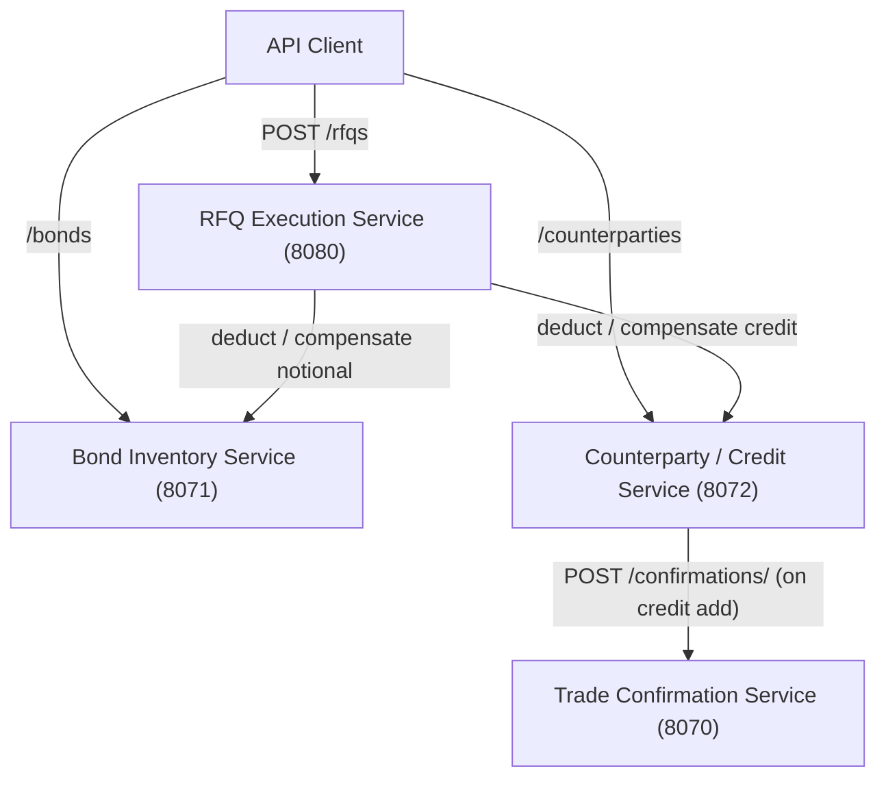
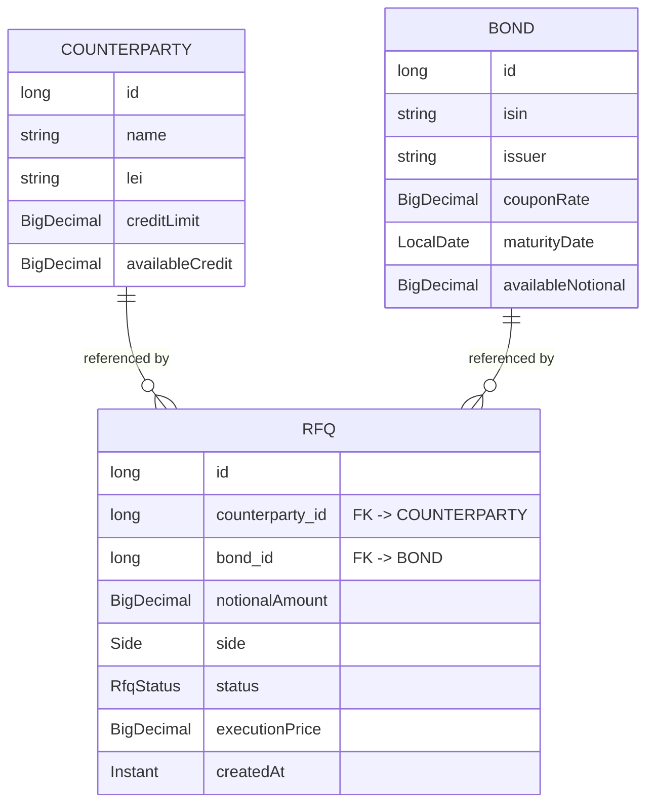
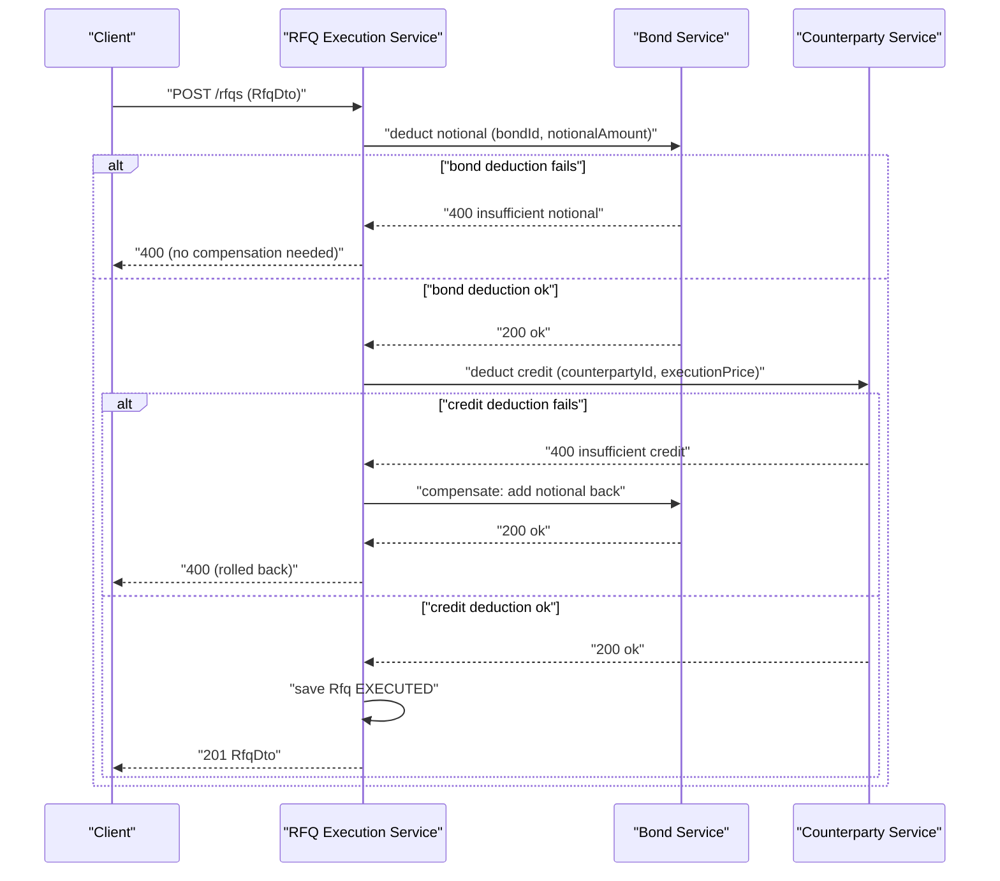

# EXTRACTION_PLAN.md

Decomposition plan for the **Fixed-Income RFQ Trading Platform** monolith
(`monolith/`) into 4 microservices.

> Package base: `com.javieraviles.splitthemonolith`
> Stack: Spring Boot 2.2.6, Java 11, Maven, Spring Data JPA, H2 (in-memory), Apache HttpClient.

---

## 1. Executive Summary

The monolith is a **bond trading platform** that lets a desk manage bond
inventory and counterparty credit, then execute Request-for-Quote (RFQ) trades.
The heart of the system is `RFQExecutionSaga.executeRfq(...)`, a single
`@Transactional` method that looks up a `Bond` and a `Counterparty`, deducts
notional from the bond and credit from the counterparty, and persists an
`EXECUTED` `Rfq`. Atomicity is currently guaranteed by the local database
transaction.

**Goal:** extract the monolith into **4 microservices**, decomposed in
**leaf-first dependency order** so that each service we carve out has no
un-extracted outbound dependencies at the time it is extracted. Concretely:

1. **Trade Confirmation Service** — pure leaf (no DB, no outbound calls). A seam
   for it already exists (`TradeConfirmationMicroserviceClient` + the
   `use.confirmation.service` feature flag).
2. **Bond Inventory Service** — self-contained, owns the `bonds` table.
3. **Counterparty/Credit Service** — owns the `counterparties` table; calls the
   Trade Confirmation Service when credit is added.
4. **RFQ Execution Service** — the orchestrator; what remains of the monolith.
   Calls the Bond and Counterparty services and replaces the local
   `@Transactional` with a compensating **saga**.

Extracting the leaves first means that by the time we refactor the RFQ
orchestrator (Phase 3), every service it must call already exists and is
validated.



Extraction order (leaf-first): **Phase 1** Confirmation → **Phase 2a** Bond →
**Phase 2b** Counterparty → **Phase 3** RFQ orchestrator.

---

## 2. Current Monolith Architecture

### 2.1 Source files by package

All classes live under `com.javieraviles.splitthemonolith`.

| Package | File | Responsibility |
|---------|------|----------------|
| (root) | `SplitTheMonolithApplication.java` | `@SpringBootApplication` + `CommandLineRunner` seed data + `RestTemplate` `@Bean` (Apache HttpClient backed) |
| `controller` | `BondController.java` | Bond CRUD + PATCH (add/deduct notional) |
| `controller` | `CounterpartyController.java` | Counterparty CRUD + PATCH (add/deduct credit, toggles confirmation seam) |
| `controller` | `RfqController.java` | RFQ GET/POST/DELETE; delegates POST to `RFQExecutionSaga`; `toDto()` mapping |
| `entity` | `Bond.java` | `@Entity(name="bonds")`; `addNotional` / `deductNotional` (throws `InsufficientNotionalException`) |
| `entity` | `Counterparty.java` | `@Entity(name="counterparties")`; `addCredit` / `deductCredit` (throws `InsufficientCreditException`); `@PrePersist` defaults `availableCredit` |
| `entity` | `Rfq.java` | `@Entity(name="rfqs")`; `@ManyToOne(EAGER)` to `Counterparty` and `Bond`; `@PrePersist` sets `createdAt` |
| `entity` | `RfqStatus.java` | enum `PENDING, QUOTED, EXECUTED, REJECTED` |
| `entity` | `Side.java` | enum `BUY, SELL` |
| `dto` | `RfqDto.java` | API contract for RFQ; already uses **plain `long counterpartyId` / `long bondId`** (not entity refs) |
| `dto` | `TradeConfirmationDto.java` | `counterpartyName: String`, `creditAmount: BigDecimal (@Positive)` |
| `dto` | `OperationEnum.java` | enum `DEDUCT, ADD` |
| `exception` | `InsufficientCreditException.java` | domain error (counterparty) |
| `exception` | `InsufficientNotionalException.java` | domain error (bond) |
| `exception` | `ResourceNotFoundException.java` | shared 404 error |
| `repository` | `BondRepository.java` | `JpaRepository<Bond, Long>` |
| `repository` | `CounterpartyRepository.java` | `JpaRepository<Counterparty, Long>` |
| `repository` | `RfqRepository.java` | `JpaRepository<Rfq, Long>` |
| `service` | `TradeConfirmationService.java` | in-process confirmation (currently just logs) |
| `restclient` | `TradeConfirmationMicroserviceClient.java` | `POST {confirmationms.url}confirmations/` via `RestTemplate` |
| `saga` | `RFQExecutionSaga.java` | `@Transactional executeRfq(RfqDto)` — the orchestration core |

Config: `src/main/resources/application.properties`

```properties
spring.jpa.open-in-view=false
server.port=8080
use.confirmation.service=false
confirmationms.url=http://localhost:8070/
```

> **Note on seed data:** there is **no `data.sql`**. Seed data is loaded in code
> via `SplitTheMonolithApplication implements CommandLineRunner` (Acme Asset
> Management counterparty, US Treasury bond, one `EXECUTED` RFQ). This matters
> for the migration: seeding logic must be split per service, not just copied
> from a SQL file.

### 2.2 REST endpoints

| Method | Path | Controller | Description |
|--------|------|------------|-------------|
| GET | `/bonds` | `BondController` | List all bonds |
| POST | `/bonds` | `BondController` | Create a bond (201) |
| GET | `/bonds/{id}` | `BondController` | Get a bond by id (404 if missing) |
| PUT | `/bonds/{id}` | `BondController` | Replace a bond |
| PATCH | `/bonds/{id}` | `BondController` | Add/deduct notional (JSON `amount`, `operation`) |
| DELETE | `/bonds/{id}` | `BondController` | Delete a bond |
| GET | `/counterparties` | `CounterpartyController` | List all counterparties |
| POST | `/counterparties` | `CounterpartyController` | Create a counterparty (201) |
| GET | `/counterparties/{id}` | `CounterpartyController` | Get a counterparty by id (404 if missing) |
| PUT | `/counterparties/{id}` | `CounterpartyController` | Replace a counterparty |
| PATCH | `/counterparties/{id}` | `CounterpartyController` | Add/deduct credit (JSON `amount`, `operation`); on ADD sends a trade confirmation |
| DELETE | `/counterparties/{id}` | `CounterpartyController` | Delete a counterparty |
| GET | `/rfqs` | `RfqController` | List all RFQs (as `RfqDto`) |
| POST | `/rfqs` | `RfqController` | Execute an RFQ via `RFQExecutionSaga` (201) |
| GET | `/rfqs/{id}` | `RfqController` | Get an RFQ by id (404 if missing) |
| DELETE | `/rfqs/{id}` | `RfqController` | Delete an RFQ |

### 2.3 Entity relationships



`Rfq` holds `@ManyToOne(fetch = EAGER)` references to both `Counterparty`
(`counterparty_id`) and `Bond` (`bond_id`). These foreign keys are the seam that
must be broken when splitting databases (see Phase 3).

### 2.4 Existing seam

The monolith already contains a **strangler-fig seam** for the confirmation
concern:

- `TradeConfirmationMicroserviceClient` is a fully implemented REST client that
  POSTs to `{confirmationms.url}confirmations/`.
- The boolean flag `use.confirmation.service` (default `false`) in
  `CounterpartyController.partialUpdateGeneric` switches between the in-process
  `TradeConfirmationService` and the remote client:

```java
if (useConfirmationService) {
    confirmationMsClient.sendConfirmation(confirmation); // remote
} else {
    tradeConfirmationService.sendTradeConfirmation(confirmation); // in-process
}
```

This is why **Trade Confirmation is Phase 1** — most of the wiring exists.

---

## 3. Target Microservices

### 3.1 Trade Confirmation Service (Phase 1)

- **Port:** 8070 (matches the existing `confirmationms.url=http://localhost:8070/`)
- **Endpoint:** `POST /confirmations/`
- **DTO:** `TradeConfirmationDto` — `counterpartyName: String`, `creditAmount: BigDecimal (@Positive)`
- **Owns:** the confirmation logic only (today `TradeConfirmationService` just logs).
- **Database:** none required initially (stateless logging endpoint). Add a
  persistence layer later if an audit trail is needed.
- **Existing seam:** `TradeConfirmationMicroserviceClient` already implements the
  client; `use.confirmation.service` toggles it. The contract is already
  exercised in production code.

### 3.2 Bond Inventory Service (Phase 2a)

- **Suggested port:** 8071
- **Endpoints:** full CRUD + PATCH from `BondController`
  (`GET/POST /bonds`, `GET/PUT/PATCH/DELETE /bonds/{id}`).
- **Owns:** `Bond` entity, `BondRepository`, `InsufficientNotionalException`,
  `OperationEnum` (its own copy).
- **Database:** its own (separate H2 or Postgres); migrate the `bonds` table.
- **Dependencies:** none outbound — self-contained leaf.

### 3.3 Counterparty/Credit Service (Phase 2b)

- **Suggested port:** 8072
- **Endpoints:** full CRUD + PATCH from `CounterpartyController`
  (`GET/POST /counterparties`, `GET/PUT/PATCH/DELETE /counterparties/{id}`).
- **Owns:** `Counterparty` entity, `CounterpartyRepository`,
  `InsufficientCreditException`, `OperationEnum` (its own copy).
- **Database:** its own; migrate the `counterparties` table.
- **Outbound dependency:** calls the **Trade Confirmation Service**
  (`POST /confirmations/`) when credit is **added** (PATCH with `operation=ADD`).
  Carries its own copy of `TradeConfirmationMicroserviceClient` and
  `TradeConfirmationDto`.

### 3.4 RFQ Execution Service (Phase 3)

- **Port:** 8080 (takes over the monolith's port — clients keep hitting `/rfqs`).
- **Endpoints:** `GET/POST /rfqs`, `GET/DELETE /rfqs/{id}`.
- **Owns:** `Rfq` entity, `RfqRepository`, refactored `RFQExecutionSaga`,
  `RfqDto`, `RfqStatus`, `Side`, `ResourceNotFoundException`.
- **Database:** its own; migrate the `rfqs` table. **Critical change:** the
  `rfqs` table currently has FKs to `bonds` and `counterparties`. After the
  split those tables live in other services, so `Rfq` must store **plain `long
  bondId` and `long counterpartyId`** instead of JPA `@ManyToOne` associations.
- **Outbound dependencies:** Bond Inventory Service and Counterparty/Credit
  Service.

---

## 4. Phased Extraction Plan

### Phase 1: Extract Trade Confirmation Service

1. **Scaffold** a new Spring Boot 2.2.6 / Java 11 project `confirmation-service/`
   as a sibling to `monolith/`.
2. **Implement** `POST /confirmations/` accepting `TradeConfirmationDto`
   (`counterpartyName`, `creditAmount`). Port the logging behavior from
   `TradeConfirmationService`. Run on port 8070.
3. **Test** the new service: unit test the controller/service, plus a
   `@SpringBootTest @AutoConfigureMockMvc` integration test that POSTs a valid
   and an invalid (non-positive `creditAmount`) payload.
4. **Contract test (monolith side):** add a WireMock-backed test that stands up a
   stub for `POST /confirmations/`, points `confirmationms.url` at it, and
   verifies `TradeConfirmationMicroserviceClient.sendConfirmation(...)` sends the
   expected JSON body and path.
5. **Flip the flag:** set `use.confirmation.service=true` in the monolith's
   `application.properties` so credit-add now routes to the remote service.
6. **End-to-end validation:** start `confirmation-service` (8070) + monolith
   (8080); `PATCH /counterparties/{id}` with `operation=ADD` and confirm the
   request reaches the confirmation service.
7. **Remove dead code from the monolith:** delete `TradeConfirmationService.java`,
   the `use.confirmation.service` flag and its `@Value` field, and collapse the
   `if/else` in `CounterpartyController` so it always calls the client. (This
   wiring later moves to the Counterparty service in Phase 2b.)

### Phase 2a: Extract Bond Inventory Service

1. **Scaffold** new Spring Boot project `bond-service/` (port 8071).
2. **Move** `Bond` entity, `BondRepository`, `InsufficientNotionalException`, and
   the `BondController` CRUD + PATCH logic. Include a copy of `OperationEnum` and
   `ResourceNotFoundException` (or a shared lib).
3. **Database:** give it its own (separate H2 or Postgres) with the `bonds`
   table; move the bond seed row (US Treasury / US912828YK15) into this service's
   `CommandLineRunner` or a `data.sql`.
4. **Test:** mirror the existing bond cases from `IntegrationTest.java`
   (`GET /bonds` returns the seeded bond) plus PATCH add/deduct and the
   insufficient-notional path.
5. **BondServiceClient in the monolith:** add a REST client modeled on
   `TradeConfirmationMicroserviceClient` (reusing the existing `RestTemplate`
   bean) exposing `findById`, `deductNotional`, `addNotional`.
6. **Wire it up behind a flag:** add `use.bond.service` and a
   `bondservice.url` property; in `RFQExecutionSaga`, branch between the local
   `BondRepository` and `BondServiceClient`.
7. **Flip, validate, clean up:** set `use.bond.service=true`, run the end-to-end
   suite, then remove `Bond`, `BondRepository`, `BondController`, and
   `InsufficientNotionalException` from the monolith.

### Phase 2b: Extract Counterparty/Credit Service

1. **Scaffold** new Spring Boot project `counterparty-service/` (port 8072).
2. **Move** `Counterparty` entity, `CounterpartyRepository`,
   `InsufficientCreditException`, and the `CounterpartyController` CRUD + PATCH
   logic. Include `OperationEnum` and `ResourceNotFoundException`.
3. **Bring the confirmation client along:** include
   `TradeConfirmationMicroserviceClient` (or an equivalent) and
   `TradeConfirmationDto` so this service calls the **Trade Confirmation Service**
   on credit-add. Carry over the `RestTemplate` bean and `confirmationms.url`.
4. **Database:** its own, with the `counterparties` table; move the Acme seed row
   into this service's seeding.
5. **Test:** mirror the counterparty cases (`GET /counterparties`), PATCH
   add/deduct, insufficient-credit path, and a WireMock contract test for the
   outbound confirmation call.
6. **CounterpartyServiceClient in the monolith:** add a REST client exposing
   `findById`, `deductCredit`, `addCredit`.
7. **Wire it up behind a flag:** add `use.counterparty.service` and
   `counterpartyservice.url`; branch in `RFQExecutionSaga`.
8. **Flip, validate, clean up:** set `use.counterparty.service=true`, run
   end-to-end, then remove `Counterparty`, `CounterpartyRepository`,
   `CounterpartyController`, `InsufficientCreditException`, and the now-unused
   confirmation client/flag from the monolith.

### Phase 3: Refactor RFQ Execution into Orchestrator

1. **Replace direct repository calls** in `RFQExecutionSaga` with HTTP calls to
   the Bond and Counterparty services (`BondServiceClient`,
   `CounterpartyServiceClient`). Drop the feature flags introduced in 2a/2b once
   the HTTP path is the only path.
2. **Replace `@Transactional` with a saga + compensating transactions:**
   - Call **Bond Service**: deduct notional. If it fails (e.g. insufficient
     notional → 400), abort and return the error; nothing to compensate yet.
   - Call **Counterparty Service**: deduct credit (`executionPrice`). If it
     fails, **compensate**: call Bond Service to **add** the notional back, then
     return the error.
   - **Save the `Rfq` locally** with status `EXECUTED`. If the local save fails,
     compensate **both** prior steps (add notional back, add credit back).
3. **Refactor the `Rfq` entity:** replace `@ManyToOne Bond bond` and
   `@ManyToOne Counterparty counterparty` with plain `long bondId` and
   `long counterpartyId` columns (keep the existing `bond_id` / `counterparty_id`
   column names for data compatibility). Remove the JPA relationships and the
   imports of `Bond`/`Counterparty`.
4. **Update `RfqController.toDto()`** to read `rfq.getBondId()` /
   `rfq.getCounterpartyId()` directly instead of `rfq.getBond().getId()` /
   `rfq.getCounterparty().getId()`. (`RfqDto` already exposes plain `long`
   ids, so the DTO contract is unchanged.)
5. **Remove all Bond and Counterparty code** still in the monolith (entities,
   repositories, controllers, exceptions) — most was already removed in 2a/2b.
6. **What remains is the RFQ Execution Service**, running on port 8080, owning
   `Rfq`, `RfqRepository`, `RfqDto`, `RfqStatus`, `Side`, `ResourceNotFoundException`,
   and the orchestrating saga.



---

## 5. Cross-Cutting Concerns

### Shared DTOs
`TradeConfirmationDto`, `OperationEnum`, and `RfqDto` are used across boundaries.
Two options: (a) each service owns its **own copy** (preferred for loose
coupling and independent evolution), or (b) publish a small **shared library**
(e.g. `trading-contracts`) versioned via Maven. Start with copies; promote to a
shared lib only if drift becomes painful. `ResourceNotFoundException` is also
duplicated per service.

### Error handling
Each service owns its **domain exceptions**: `InsufficientNotionalException`
(Bond), `InsufficientCreditException` (Counterparty), and a local
`ResourceNotFoundException` in each. Today these surface as `400` (insufficient)
and `404` (not found). The **orchestrator (RFQ service)** must translate HTTP
status codes from downstream services back into the right responses — e.g. a
`400` from Bond Service → propagate `400`; a `404` from either → `404` — and use
those signals to decide whether to compensate.

### Database migration
Currently a **single in-memory H2 database** with `ddl-auto` creating the schema
and `CommandLineRunner` seeding three rows. Each service needs its **own
database**:
- `bonds` → Bond Service DB (seed: US Treasury / US912828YK15).
- `counterparties` → Counterparty Service DB (seed: Acme Asset Management).
- `rfqs` → RFQ Service DB (seed: the one EXECUTED RFQ, now referencing the bond
  and counterparty by **id** rather than FK).
Because seed data lives in **code (`CommandLineRunner`)**, not a `data.sql`, the
seeding must be split per service rather than copied from a SQL script. The
cross-table FKs in `rfqs` become plain `long` ids (no DB-enforced referential
integrity across services).

### Service discovery
For now, **hardcode URLs** in `application.properties` (following the existing
`confirmationms.url` pattern): `bondservice.url`, `counterpartyservice.url`,
`confirmationms.url`. Future: introduce Spring Cloud with **Eureka** or
**Consul** (and/or a gateway) so services resolve each other by name.

### Testing strategy
- Each service gets its **own integration tests** (`@SpringBootTest` +
  `@AutoConfigureMockMvc`, mirroring the existing `IntegrationTest.java` cases
  for its slice).
- Add **contract tests** at every service boundary (WireMock, or Spring Cloud
  Contract) — confirmation, bond, and counterparty clients.
- The existing `IntegrationTest.java` (6 tests: counterparty list, bond list,
  RFQ happy path, insufficient notional, insufficient credit, non-existent
  counterparty, non-existent bond) becomes an **end-to-end suite** run against
  all 4 services together.

### Distributed transactions
`RFQExecutionSaga` relies on `@Transactional` for atomicity today. After
extraction there is no shared transaction, so implement the **saga compensation
pattern** (see the Phase 3 sequence diagram):

| Step | Action | Compensation if a later step fails |
|------|--------|-------------------------------------|
| 1 | Bond Service: deduct notional | Bond Service: add notional back |
| 2 | Counterparty Service: deduct credit | Counterparty Service: add credit back |
| 3 | RFQ Service: save `Rfq` (EXECUTED) | (terminal — compensate steps 1 & 2 if save fails) |

---

## 6. Risk Register

| Risk | Description | Mitigation |
|------|-------------|------------|
| Distributed transaction consistency | Saga compensation is not atomic; a crash between deduct and compensate can leave temporary inconsistency (e.g. notional deducted but credit not). | Idempotent compensating endpoints; persist saga state / outbox; reconciliation job; consider marking RFQs `PENDING` until both legs confirm. |
| Network failures between services | HTTP calls can time out or fail transiently, unlike the old in-process call. | Add retries with backoff + circuit breakers (e.g. **Resilience4j**); sensible timeouts; treat ambiguous failures as needing compensation/reconciliation. |
| Data migration risk | Splitting the shared H2 DB and re-pointing `rfqs` FKs to plain ids can corrupt or orphan data. | Migrate per table with verification scripts; keep `bond_id`/`counterparty_id` column names; validate row counts and id integrity before cut-over. |
| Increased operational complexity | 4 deployables instead of 1 — more to build, deploy, monitor, and correlate. | Centralized logging/tracing (correlation ids), health checks, per-service dashboards; automate deploys; start with hardcoded URLs then service discovery. |
| API versioning across services | Independent deploys can break consumers if a contract changes. | Version the DTOs/endpoints; enforce **contract tests** in CI; backward-compatible changes only; shared-contract lib if drift grows. |

---

*This plan follows the strangler-fig approach already seeded in the codebase:
introduce a client + feature flag, validate with contract and end-to-end tests,
flip the flag, then delete the dead code — repeating leaf-first until only the
RFQ orchestrator remains.*
