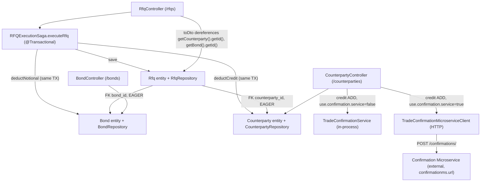

# Microservices Decomposition Strategy

## 1. Overview / Context

This repository is a fixed-income **Request-for-Quote (RFQ) trading platform** implemented as a Spring Boot monolith (Java 11, Spring Data JPA, H2 in-memory database) under the `monolith/` module. It models four business capabilities — counterparty credit management, bond inventory management, RFQ trade execution/orchestration, and trade confirmation — inside a single deployable, single schema, and single transactional boundary. The goal of this document is to define an **incremental, low-risk path to decompose the monolith into independently deployable microservices** using the **strangler-fig pattern**: rather than a big-bang rewrite, we peel off capabilities one at a time behind stable interfaces, starting with the least-coupled seam already present in the code, and progressively replacing the monolith's implicit local-transaction guarantees with explicit distributed-saga semantics. Each phase is independently shippable and reversible so that the platform continues trading throughout the migration.

## 2. Business Domain Map

The monolith already partitions cleanly along four capabilities. Each has a distinct owning entity, repository, and controller (except Trade Confirmation, which is a cross-cutting notification capability with no persistent entity of its own).

| Capability | Responsibility | Owning Entity | Repository | Controller / Component |
|------------|----------------|---------------|------------|------------------------|
| **Counterparty (credit)** | Legal entities, credit limits, available credit; enforces credit risk | `entity/Counterparty.java` | `repository/CounterpartyRepository.java` | `controller/CounterpartyController.java` |
| **Bond (inventory)** | Bond reference data (ISIN, issuer, coupon, maturity) and available notional inventory | `entity/Bond.java` | `repository/BondRepository.java` | `controller/BondController.java` |
| **RFQ (trade execution / orchestration)** | Executes an RFQ atomically, mutating bond notional + counterparty credit and persisting the trade | `entity/Rfq.java` | `repository/RfqRepository.java` | `controller/RfqController.java` + `saga/RFQExecutionSaga.java` |
| **Trade Confirmation (notification)** | Emits a confirmation when credit is added; in-process logger **or** remote microservice | *(none — DTO only:* `dto/TradeConfirmationDto.java`*)* | *(none)* | `service/TradeConfirmationService.java` (local) / `restclient/TradeConfirmationMicroserviceClient.java` (remote) |

## 3. Coupling Analysis

The couplings below are ranked from tightest (hardest to break) to loosest (already broken). The first two are the primary obstacles to decomposition.

### (a) Shared single `@Transactional` boundary in `RFQExecutionSaga.executeRfq` — tightest
`saga/RFQExecutionSaga.executeRfq(RfqDto)` is annotated `@Transactional` and, within one database transaction, it:
1. loads the `Bond` and `Counterparty`,
2. calls `bond.deductNotional(...)` (Bond capability),
3. calls `counterparty.deductCredit(...)` (Counterparty capability),
4. saves a new `Rfq`.

The in-code comment is explicit that **no saga compensation is needed** because "credit will only be deducted if the bond had sufficient available notional" and everything shares one transaction — if `deductCredit` throws `InsufficientCreditException`, the whole transaction (including the notional deduction) rolls back automatically. This "saga" is a saga in name only; it relies entirely on a **local ACID transaction spanning two would-be service boundaries**. The moment Bond and Counterparty live in separate services/databases, this atomicity guarantee disappears and must be replaced with an explicit distributed saga.

### (b) Database-level FK coupling + object-graph dereferencing — very tight
`Rfq` holds two `@ManyToOne` `@JoinColumn` foreign keys, `counterparty_id` and `bond_id`, **both `FetchType.EAGER`**. This means:
- The `rfqs` table is physically joined to `counterparties` and `bonds` in a single schema; splitting databases breaks referential integrity.
- Every load of an `Rfq` eagerly pulls the full `Counterparty` and `Bond` object graph.
- `RfqController.toDto` dereferences that graph directly — `rfq.getCounterparty().getId()` and `rfq.getBond().getId()` — so the RFQ read path structurally depends on the other two aggregates being co-located and navigable in memory.

Decomposition requires replacing these object references with **stored identifiers** (e.g. persisting `counterpartyId` / `bondId` as plain columns on `Rfq`) and fetching any additional bond/counterparty detail over a remote read path.

### (c) Domain rules embedded in entities — moderate
Core business invariants live inside the entities themselves: `Bond.deductNotional` throws `InsufficientNotionalException` and `Counterparty.deductCredit` throws `InsufficientCreditException`. These rules are correct and valuable, but they are invoked in-process by the saga. Once Bond and Counterparty are separate services, these guards must be enforced **behind the service API** (the owning service validates and rejects), not by an in-JVM method call from the RFQ orchestrator.

### (d) Trade Confirmation — already decoupled (loosest)
Trade Confirmation is effectively **already extracted at the seam**. `CounterpartyController`'s PATCH credit-`ADD` path builds a `TradeConfirmationDto` and dispatches it through a toggle: when `use.confirmation.service=true` it calls `TradeConfirmationMicroserviceClient.sendConfirmation(...)` (HTTP POST to `confirmationms.url` = `http://localhost:8070/confirmations/`), otherwise it calls the in-process `TradeConfirmationService.sendTradeConfirmation(...)` (which just logs). There are **no shared tables and no shared transaction** with confirmation — it is fire-and-forget notification. This is the cheapest and safest first extraction.

### Dependency diagram

## 4. Phased Decomposition Roadmap

Each phase is independently deployable and reversible. Phases are ordered by increasing risk, deliberately deferring the shared-transaction problem until the organizational and platform foundations are in place.

### Phase 0 — Foundations (no service extracted yet)

| Aspect | Detail |
|--------|--------|
| **Goal** | Establish the platform capabilities required before any service can be safely pulled out. |
| **Scope** | Define explicit **API contracts** (OpenAPI) for each of the four capabilities as they exist today; add **observability** (structured logging, metrics, distributed tracing / correlation IDs across the RFQ flow); stand up **CI/CD** for independently buildable/deployable units; introduce **DB seams** by carving the single schema into per-domain schemas (`counterparty`, `bond`, `rfq`) even while co-located, forbidding cross-schema joins; write **contract tests** that pin current request/response shapes (`RfqDto`, `Counterparty`, `Bond`, `TradeConfirmationDto`). |
| **Risks** | Mostly organizational; low technical risk since nothing is physically split yet. Hidden cross-schema joins (notably the `rfqs → counterparties/bonds` FKs) will surface here — that discovery is the point. |
| **Rollback** | Trivial — no runtime topology change. Revert schema separation to a single schema if migrations misbehave. |

### Phase 1 — Extract Trade Confirmation service (first, cheapest, safest)

| Aspect | Detail |
|--------|--------|
| **Goal** | Prove the strangler pattern end-to-end on the capability that is already decoupled behind a toggle. |
| **Scope** | Trade Confirmation only. It already has an HTTP client (`TradeConfirmationMicroserviceClient`), a feature flag (`use.confirmation.service`), a configurable base URL (`confirmationms.url`), no shared tables, and no shared transaction. |
| **Steps** | 1. **Flip the toggle** (`use.confirmation.service=true`) in a non-prod environment and point `confirmationms.url` at the deployed confirmation service. 2. **Harden the client** with connect/read **timeouts and retries** (with backoff) and a circuit breaker, so a slow/absent confirmation service cannot degrade the credit-ADD path. 3. **Move behind an async / event boundary** — publish a "credit added" event to a broker instead of a synchronous POST, so confirmation delivery is decoupled from the caller's latency and failures. 4. **Decommission the in-process `TradeConfirmationService`** once the remote path is proven, removing the local branch from `CounterpartyController`. |
| **Risks** | Low. Confirmation is fire-and-forget notification; worst case is a missed/delayed notification, not a corrupted trade. Main risk is treating a synchronous call as reliable — mitigated by async delivery + retries + idempotency. |
| **Rollback** | Flip `use.confirmation.service=false` to instantly revert to the in-process logger. This single-flag reversibility is exactly why this capability goes first. |

### Phase 2 — Extract Bond (inventory) service

| Aspect | Detail |
|--------|--------|
| **Goal** | Move bond reference data and notional inventory into an independent service with its own schema. |
| **Scope** | `Bond` entity, `BondRepository`, `BondController`, and the `bond.deductNotional` invariant. Introduces the first cross-service *write* in the RFQ flow. |
| **Steps** | 1. Stand up the Bond service with its own `bond` schema; migrate bond data. 2. Introduce a **remote read path** for bond metadata so `RfqController.toDto` and any bond lookups no longer traverse the JPA object graph. 3. On `Rfq`, replace the `@ManyToOne bond` reference with a stored `bondId` column. 4. Replace the **in-transaction `bond.deductNotional(...)`** call in `RFQExecutionSaga` with a **remote service call** to the Bond service, guarded by **saga compensation** (a reserve/release semantics: reserve notional before credit is touched, release it if the RFQ later fails). The Bond service enforces `InsufficientNotionalException` behind its API. |
| **Risks** | High — this is where the shared local transaction first breaks. A crash between "notional deducted remotely" and "RFQ saved locally" can leak reserved notional. Mitigated by compensation + idempotency + reconciliation. |
| **Rollback** | Route `deductNotional` back to the in-process path (feature-flagged dual-write / read-from-monolith fallback) until the remote path is trusted. Keep the monolith's bond tables in sync during a bake-in period. |

### Phase 3 — Extract Counterparty (credit) service

| Aspect | Detail |
|--------|--------|
| **Goal** | Move counterparty and credit management into an independent service, mirroring Phase 2. |
| **Scope** | `Counterparty` entity, `CounterpartyRepository`, `CounterpartyController`, and the `counterparty.deductCredit` invariant. Also finalizes the confirmation ownership — the credit-ADD confirmation event now naturally originates from the Counterparty service. |
| **Steps** | 1. Stand up the Counterparty service with its own `counterparty` schema; migrate data. 2. Introduce a remote read path for counterparty metadata; replace `Rfq`'s `@ManyToOne counterparty` reference with a stored `counterpartyId`. 3. Replace the **in-transaction `counterparty.deductCredit(...)`** call in the saga with a **remote call plus compensation** (reserve/release credit), with `InsufficientCreditException` enforced behind the Counterparty service API. |
| **Risks** | High, same class as Phase 2 — cross-service credit mutation without a shared transaction. Additional care: credit is money-adjacent, so idempotency and exactly-once effect on `deductCredit`/`addCredit` are critical. |
| **Rollback** | Same dual-path strategy as Phase 2: flag credit deduction back to in-process until the distributed path is proven. |

### Phase 4 — RFQ becomes a true orchestrator (distributed saga)

| Aspect | Detail |
|--------|--------|
| **Goal** | Replace the current implicit local-transaction rollback with an explicit **distributed saga with compensating transactions**. |
| **Scope** | `RFQExecutionSaga` is rewritten from a `@Transactional` in-JVM method into an orchestrator coordinating Bond, Counterparty, and Trade Confirmation services. |
| **Steps** | Implement **reserve / confirm / cancel** semantics: (1) *reserve* notional on the Bond service and *reserve* credit on the Counterparty service; (2) if both succeed, *confirm* both and persist the `Rfq` (status `EXECUTED`); (3) if any step fails, *cancel* (compensate) the already-reserved steps and persist the RFQ as `REJECTED`. The `PENDING`/`QUOTED`/`EXECUTED`/`REJECTED` lifecycle already present on `RfqStatus` maps naturally onto saga states. |
| **Risks** | Highest — full distributed-transaction complexity: partial failures, compensation failures, in-doubt states, ordering. Requires robust retries, idempotency keys, timeouts, and a reconciliation/dead-letter process. |
| **Rollback** | Hardest to roll back once live. Mitigate with a long dual-run/shadow period comparing saga outcomes against the monolith's transactional path before cutting over write traffic. |

## 5. Cross-Cutting Concerns

- **Distributed transactions / saga compensation.** The monolith leans entirely on one `@Transactional` boundary (`RFQExecutionSaga`) so that a failed `deductCredit` automatically rolls back `deductNotional`. Once Bond and Counterparty are separate services this guarantee is gone and must be re-implemented as an orchestrated saga with explicit **compensating actions** (release reserved notional, restore credit). Reserve/confirm/cancel is preferable to naive "do then undo" because it avoids exposing partially-applied state.
- **Data ownership & de-normalization of the FK relationships.** Today `rfqs.counterparty_id` and `rfqs.bond_id` are enforced FKs with EAGER navigation. Post-split, each service owns its own schema and cross-service FKs are not allowed. `Rfq` must store bare `counterpartyId` / `bondId` values, and any counterparty/bond attributes the RFQ view needs should be **de-normalized/cached** onto the RFQ (or fetched via a remote read), accepting that they are point-in-time copies.
- **Eventual consistency.** Cross-service reads (and the confirmation event) become eventually consistent. The RFQ read model may briefly show stale bond/counterparty attributes; UIs and downstream consumers must tolerate this rather than assuming a synchronous, fully-joined view.
- **Idempotency.** Every cross-service mutation — `deductNotional`, `deductCredit`, `addCredit`, `sendConfirmation` — must be **idempotent**, keyed by a stable RFQ / operation identifier, so retries after timeouts do not double-deduct notional or credit or double-send confirmations.
- **Testing strategy.** Preserve the existing `IntegrationTest.java` scenarios (successful execution, insufficient notional, insufficient credit, missing counterparty/bond) as **behavioral acceptance tests** across the migration. Add **consumer-driven contract tests** for each extracted API, **saga tests** that inject failures at each step to verify compensation, and **reconciliation checks** that assert no orphaned reservations remain.

## 6. Recommended First Step & Rationale

**Extract Trade Confirmation first (Phase 1).** It is the only capability that is *already* decoupled at the seam: it is dispatched behind the `use.confirmation.service` toggle, already has a dedicated HTTP client (`TradeConfirmationMicroserviceClient`) and configurable endpoint (`confirmationms.url`), shares **no tables** and **no transaction** with any other capability, and is semantically fire-and-forget. Extraction is therefore low-risk, fully reversible with a single flag flip, and lets the team exercise the entire strangler toolchain (contracts, deployment, observability, async delivery, rollback) on a capability where a mistake cannot corrupt a trade.

By contrast, **Bond and Counterparty are deliberately deferred** because both are trapped inside `RFQExecutionSaga.executeRfq`'s single `@Transactional` boundary, which mutates both aggregates and relies on **local rollback** for atomicity (the code comment even states no compensation is needed *precisely because* it is one transaction). Extracting either one severs that atomicity and forces the introduction of a distributed saga with compensating transactions, reserve/confirm/cancel semantics, idempotency, and reconciliation — a substantially larger and riskier change. Sequencing Trade Confirmation → Bond → Counterparty → RFQ-orchestrator tackles the hardest, money-and-inventory-affecting coupling last, only after the foundations and patterns are proven on safer ground.

> **Note on the remote confirmation microservice.** This document intentionally makes no assumptions about the external confirmation service beyond what the client and configuration reveal: it is reached via HTTP POST to `confirmationms.url` (`http://localhost:8070/confirmations/`) with a `TradeConfirmationDto` payload (`counterpartyName`, `creditAmount`). Its schema, deployment, and availability are **external to this repository** and must be confirmed with its owning team before flipping `use.confirmation.service`.
