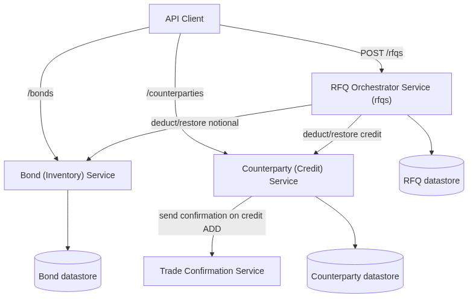
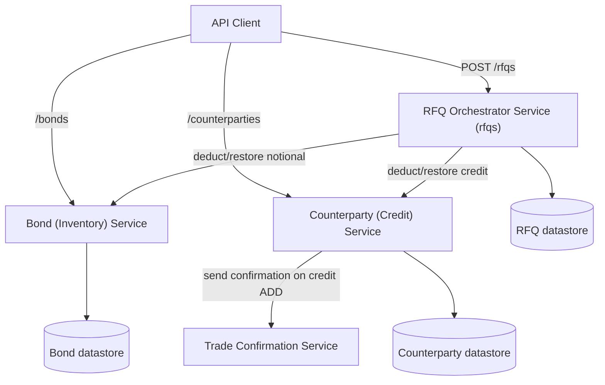

# Microservices Decomposition Strategy

> **Status:** Proposed · **Type:** Engineering decision document · **Scope:** `monolith/`
>
> This document formalizes a [strangler-pattern](https://martinfowler.com/bliki/StranglerFigApplication.html) plan for
> incrementally decomposing the Spring Boot monolith under `monolith/` into microservices. It is a planning deliverable
> only; no application code is changed by this document. Every claim below is grounded in the current codebase, with
> `file:line` references so the plan can be re-verified as the code evolves.

All file paths are relative to the repository root. Java sources live under
`monolith/src/main/java/com/javieraviles/splitthemonolith/`, abbreviated below as `.../` for readability.

---

## 1. Business Domains

The monolith bundles four business capabilities. Three are backed by persisted entities and JPA repositories; the fourth
(Trade Confirmation) owns no tables and is purely an outbound integration/notification concern.

| Capability | Owning entity | Repository | Controller | Endpoints |
|---|---|---|---|---|
| **Bond (Inventory)** | `Bond` (`.../entity/Bond.java`) — table `bonds`, `isin`, `issuer`, `couponRate`, `maturityDate`, `availableNotional`; `addNotional`/`deductNotional` behavior | `BondRepository` (`.../repository/BondRepository.java`) | `BondController` (`.../controller/BondController.java`) | `GET /bonds`, `POST /bonds`, `GET /bonds/{id}`, `PUT /bonds/{id}`, `PATCH /bonds/{id}` (add/deduct notional), `DELETE /bonds/{id}` |
| **Counterparty (Credit)** | `Counterparty` (`.../entity/Counterparty.java`) — table `counterparties`, `name`, `lei`, `creditLimit`, `availableCredit`; `addCredit`/`deductCredit` behavior | `CounterpartyRepository` (`.../repository/CounterpartyRepository.java`) | `CounterpartyController` (`.../controller/CounterpartyController.java`) | `GET /counterparties`, `POST /counterparties`, `GET /counterparties/{id}`, `PUT /counterparties/{id}`, `PATCH /counterparties/{id}` (add/deduct credit), `DELETE /counterparties/{id}` |
| **RFQ (Execution / Orchestration)** | `Rfq` (`.../entity/Rfq.java`) — table `rfqs`, `@ManyToOne` `counterparty`/`bond`, `notionalAmount`, `side` (`Side`), `status` (`RfqStatus`), `executionPrice`, `createdAt` | `RfqRepository` (`.../repository/RfqRepository.java`) | `RfqController` (`.../controller/RfqController.java`) + `RFQExecutionSaga` (`.../saga/RFQExecutionSaga.java`) | `GET /rfqs`, `POST /rfqs` (execute via saga), `GET /rfqs/{id}`, `DELETE /rfqs/{id}` |
| **Trade Confirmation** | *(none — no entity, no table)* | *(none)* | *(no dedicated controller; invoked from `CounterpartyController`)* | *(no owned HTTP endpoint in the monolith; calls out to `confirmationms.url` + `confirmations/` when enabled)* |

Supporting types shared across domains: `Side` (`BUY`/`SELL`, `.../entity/Side.java`), `RfqStatus`
(`PENDING`/`QUOTED`/`EXECUTED`/`REJECTED`, `.../entity/RfqStatus.java`), `OperationEnum` (`ADD`/`DEDUCT`,
`.../dto/OperationEnum.java`), and the DTOs `RfqDto` (`.../dto/RfqDto.java`) and `TradeConfirmationDto`
(`.../dto/TradeConfirmationDto.java`).

---

## 2. Coupling Analysis

The decomposition is gated almost entirely by the coupling introduced through the RFQ execution flow. Bond and
Counterparty are independent of each other; they only ever meet inside RFQ.

### 2.1 Shared database: `Rfq` → `Bond` / `Counterparty` foreign keys (tightest coupling)

`Rfq` holds **EAGER** `@ManyToOne` associations to both `Counterparty` and `Bond`, with foreign-key columns
`counterparty_id` and `bond_id`:

```java
// .../entity/Rfq.java:27-35
@NotNull
@ManyToOne(fetch = FetchType.EAGER)
@JoinColumn(name = "counterparty_id")
private Counterparty counterparty;

@NotNull
@ManyToOne(fetch = FetchType.EAGER)
@JoinColumn(name = "bond_id")
private Bond bond;
```

This means the `rfqs` table has FK constraints/joins into `counterparties` and `bonds`, all three living in a single
shared H2 schema. Reading an RFQ eagerly loads the full `Bond` and `Counterparty` rows via SQL joins. **Any split that
puts these three entities into separate datastores breaks these object-level associations and the FK integrity that
backs them.**

### 2.2 Shared ACID transaction: `RFQExecutionSaga.executeRfq`

Despite the name, `RFQExecutionSaga` is **not** a distributed saga — it is a single local `@Transactional` method that
mutates all three aggregates and relies on database rollback for atomicity:

```java
// .../saga/RFQExecutionSaga.java:29-47
@Transactional
public Rfq executeRfq(final RfqDto rfqDto) {
    final Bond bond = bondRepository.findById(rfqDto.getBondId())...;
    final Counterparty counterparty = counterpartyRepository.findById(rfqDto.getCounterpartyId())...;

    bond.deductNotional(rfqDto.getNotionalAmount());
    // "No need for saga compensation" — see comment at :38-42
    counterparty.deductCredit(rfqDto.getExecutionPrice());

    return rfqRepository.save(new Rfq(counterparty, bond, ..., RfqStatus.EXECUTED, ...));
}
```

The in-code comment (`.../saga/RFQExecutionSaga.java:38-42`) explicitly states there is **no saga compensation**,
because a thrown `InsufficientNotionalException` (`Bond.deductNotional`, `.../entity/Bond.java:52-57`) or
`InsufficientCreditException` (`Counterparty.deductCredit`, `.../entity/Counterparty.java:58-63`) rolls back the whole
transaction. This ACID guarantee is provided entirely by the single shared database. **Once Bond, Counterparty, and RFQ
live in separate datastores, one local transaction can no longer span all three mutations, and this guarantee
disappears** — it must be replaced by explicit orchestration with compensating actions (Phase 3).

### 2.3 Direct repository fan-out from the saga

`RFQExecutionSaga` `@Autowired`s all three repositories directly and calls them in-process:

```java
// .../saga/RFQExecutionSaga.java:20-27
@Autowired private RfqRepository rfqRepository;
@Autowired private CounterpartyRepository counterpartyRepository;
@Autowired private BondRepository bondRepository;
```

Each in-process repository call (`.../saga/RFQExecutionSaga.java:32-45`) becomes a candidate remote call once the
domains are extracted, so the saga is the single component that must change most during decomposition.

### 2.4 Object-graph navigation in the API mapping layer

`RfqController.toDto` reaches through the loaded associations to project foreign keys into `RfqDto`:

```java
// .../controller/RfqController.java:53-57
private RfqDto toDto(final Rfq rfq) {
    return new RfqDto(rfq.getId(), rfq.getCounterparty().getId(), rfq.getBond().getId(), ...);
}
```

`rfq.getCounterparty().getId()` and `rfq.getBond().getId()` depend on the EAGER associations of §2.1. If `Rfq` is
refactored to hold plain `counterpartyId`/`bondId` values (Phase 2), this mapping must be updated to read the IDs
directly rather than navigating the object graph. Note that `RfqDto` already exposes the relationships as scalar IDs
(`counterpartyId`, `bondId` — `.../dto/RfqDto.java:16-20`), so the external API contract is already ID-based; only the
internal entity and mapper are graph-based.

### 2.5 No Bond ↔ Counterparty coupling

Bond and Counterparty have **no direct dependency on each other**. Neither entity, repository, nor controller references
the other; they only ever meet inside the RFQ execution flow (`.../saga/RFQExecutionSaga.java`). This is important: it
means Bond (Inventory) and Counterparty (Credit) can be extracted independently and in either order once RFQ has been
decoupled from them.

### 2.6 Trade Confirmation is triggered from Counterparty, not the saga

Trade Confirmation is **not** part of the RFQ execution path. It is invoked from
`CounterpartyController.partialUpdateGeneric` when credit is **added** (`OperationEnum.ADD`), gated by the
`use.confirmation.service` toggle:

```java
// .../controller/CounterpartyController.java:80-90
if (operation == OperationEnum.ADD) {
    counterparty.addCredit(creditAmount);
    final TradeConfirmationDto confirmation = new TradeConfirmationDto(counterparty.getName(), creditAmount);
    if (useConfirmationService) {
        confirmationMsClient.sendConfirmation(confirmation);   // remote HTTP
    } else {
        tradeConfirmationService.sendTradeConfirmation(confirmation); // local logger
    }
} else {
    counterparty.deductCredit(creditAmount);
}
```

The confirmation is already abstracted behind two interchangeable implementations selected by the toggle
(`.../controller/CounterpartyController.java:33-43`):

- **Local:** `TradeConfirmationService.sendTradeConfirmation` — just logs (`.../service/TradeConfirmationService.java:14-17`).
- **Remote:** `TradeConfirmationMicroserviceClient.sendConfirmation` — `POST`s `TradeConfirmationDto` to
  `${confirmationms.url}` + `confirmations/` via `RestTemplate` (`.../restclient/TradeConfirmationMicroserviceClient.java:23-26`).

Its entire contract is the narrow `TradeConfirmationDto` (`counterpartyName`, `creditAmount` —
`.../dto/TradeConfirmationDto.java:9-12`), and it owns no persistent state. This is what makes it the safest first
extraction (Phase 1).

### 2.7 Configuration coupling

All toggles/URLs live in one properties file (`monolith/src/main/resources/application.properties`):

```properties
spring.jpa.open-in-view=false
server.port=8080
use.confirmation.service=false
confirmationms.url=http://localhost:8070/
```

`use.confirmation.service` (`:3`) selects local vs. remote confirmation; `confirmationms.url` (`:4`) is the target base
URI. These already exist, so flipping to the extracted confirmation service is a config change, not a code change.

---

## 3. Phased Extraction Roadmap

Ordering principle: extract the **cheapest, most-decoupled** capability first to build the migration muscle and CI/test
safety net, then progressively attack the hard shared-transaction/shared-DB coupling. Each phase is independently
shippable and reversible.

### Phase 0 — Baseline & guardrails

**Goal:** Establish a regression net and contracts before moving anything.

- Document the four domains and their couplings (this document).
- Lock in `monolith/src/test/java/com/javieraviles/splitthemonolith/IntegrationTest.java` as the behavioral regression
  net — it covers RFQ execution plus the insufficient-notional, insufficient-credit, and missing-counterparty/bond
  paths (see `README.md:90`). No extraction should be merged that changes its observed behavior.
- Add **API contract tests** for the public REST surface (`/bonds`, `/counterparties`, `/rfqs`) so responses stay
  stable as internals move. Since `RfqDto` is already ID-based, these contracts are extraction-friendly.

**Testing / validation:**
1. Establish the green baseline: `cd monolith && ./mvnw clean test` — all of `IntegrationTest.java` must pass; capture this as the reference run.
2. Boot the app (`./mvnw spring-boot:run`) and capture golden responses for the seed data (README §Seed Data) as fixtures:
   ```bash
   curl -s localhost:8080/counterparties > baseline/counterparties.json
   curl -s localhost:8080/bonds          > baseline/bonds.json
   curl -s localhost:8080/rfqs           > baseline/rfqs.json
   ```
3. Exercise the RFQ execution happy path and the two failure paths, asserting inventory/credit side effects:
   ```bash
   # happy path -> 201, status EXECUTED
   curl -s -XPOST localhost:8080/rfqs -H 'Content-Type: application/json' \
     -d '{"counterpartyId":1,"bondId":1,"notionalAmount":1000000,"side":"BUY","executionPrice":997500}'
   # insufficient notional / credit -> error, and GET /bonds,/counterparties show NO change (atomicity)
   ```
4. Add API contract tests that pin the JSON shape of `/bonds`, `/counterparties`, `/rfqs` (e.g. `@SpringBootTest` +
   `MockMvc` `jsonPath` assertions, or a REST-assured suite) and wire `mvn test` into CI as the required gate.

**Acceptance:** baseline test suite green + contract tests committed and passing in CI.

**Rationale:** You cannot safely strangle what you cannot verify. **Risks:** existing tests may under-specify edge
behavior. **Rollback:** none needed — additive only.

### Phase 1 — Extract Trade Confirmation service (first: cheapest & safest)

**Goal:** Stand up the confirmation capability as an independent microservice.

Trade Confirmation is the natural first cut because:
- It is **already abstracted** behind `TradeConfirmationMicroserviceClient` and toggled by
  `use.confirmation.service` / `confirmationms.url` (§2.6, §2.7).
- It **owns no tables**, so there is no data migration.
- Its contract is the single narrow `TradeConfirmationDto`.

**Steps:**
1. Create a **new** standalone confirmation microservice exposing `POST /confirmations/` accepting `TradeConfirmationDto`.
   > Note: this service must be built from scratch — only `monolith/` exists in the repository today; there is no
   > pre-existing confirmation service module to lift out.
2. Point `confirmationms.url` at the new service and flip `use.confirmation.service=true`.
3. Keep `TradeConfirmationService` (local logger) as the fallback for `use.confirmation.service=false`.

**Testing / validation:**
1. Unit-test the new confirmation service in isolation: `POST /confirmations/` with a valid `TradeConfirmationDto`
   returns 2xx; malformed/negative `creditAmount` is rejected (mirrors the `@Positive` constraint in `TradeConfirmationDto`).
2. Contract test the monolith→service boundary: with `use.confirmation.service=true` and `confirmationms.url` pointed at
   a stub (WireMock/MockWebServer), `PATCH /counterparties/{id}` with `{"amount":"100","operation":"ADD"}` must issue
   exactly one `POST` to `confirmations/` carrying `{counterpartyName, creditAmount}`.
3. Toggle regression: with `use.confirmation.service=false`, the same PATCH must NOT call the remote service and must
   still log via `TradeConfirmationService` — proving the fallback path is intact.
4. Negative/resilience: point `confirmationms.url` at an unreachable/slow endpoint and confirm the credit-ADD behavior
   under timeout matches the agreed policy (fail-safe vs. fail-fast).
5. Re-run the full Phase 0 baseline suite — behavior of `/rfqs` must be unchanged (confirmation is off the RFQ path).

**Acceptance:** both toggle states verified, contract test green, Phase 0 baseline still green.

**Rationale:** proves the strangler toggle end-to-end with minimal blast radius. **Risks:** the remote call in
`CounterpartyController` is synchronous with no timeout/retry today — a slow confirmation service could degrade the
credit-add path; add timeouts and consider async/fire-and-forget. **Rollback:** set `use.confirmation.service=false` to
revert to the in-process logger instantly (no redeploy of behavior beyond config).

### Phase 2 — Decouple `Rfq` from `Bond` / `Counterparty` (ID references)

**Goal:** Remove the object-graph/FK coupling so RFQ no longer requires Bond and Counterparty to share its schema.

**Steps:**
1. Replace the `@ManyToOne` associations in `Rfq` (`.../entity/Rfq.java:27-35`) with plain identifier fields
   (`long counterpartyId`, `long bondId`), keeping the `counterparty_id` / `bond_id` columns.
2. Update `RfqController.toDto` (`.../controller/RfqController.java:53-57`) to read the ID fields directly instead of
   navigating `getCounterparty().getId()` / `getBond().getId()`.
3. Adjust `RFQExecutionSaga` to load Bond/Counterparty by ID explicitly (it already receives IDs via `RfqDto`).

**Testing / validation:**
1. Re-run `IntegrationTest.java` and the Phase 0 contract tests — the external `RfqDto` shape (already ID-based) must be
   **byte-for-byte unchanged**; diff `GET /rfqs` output against the Phase 0 golden fixtures.
2. Add a mapping unit test for `RfqController.toDto` asserting `counterpartyId`/`bondId` are populated from the new
   scalar fields (not via `getCounterparty().getId()`).
3. Referential-integrity test: `POST /rfqs` referencing a non-existent `bondId`/`counterpartyId` must return the same
   not-found behavior as today (now enforced in app logic rather than FK) — add explicit cases.
4. Persistence round-trip test: save and reload an `Rfq`, asserting the `counterparty_id`/`bond_id` columns still
   hold the correct values after the entity refactor.

**Acceptance:** RFQ JSON contract diff is empty vs. Phase 0 fixtures; new referential-integrity cases pass.

**Rationale:** this is a prerequisite for separate datastores; it converts a physical join into a logical reference.
**Risks:** loss of FK-enforced referential integrity (an RFQ can now reference a non-existent bond/counterparty) — must
be validated in application logic; eager-load code paths and any join-based queries need review. **Rollback:** revert
the entity/mapper change; columns are unchanged so no schema migration is required to roll back within a shared DB.

### Phase 3 — Convert `RFQExecutionSaga` into a true orchestration saga

**Goal:** Replace the single shared `@Transactional` guarantee (§2.2) with an orchestrated saga that has explicit
compensating actions.

**Steps:**
1. Re-implement `executeRfq` as an orchestration: (a) reserve/deduct notional on Bond, (b) reserve/deduct credit on
   Counterparty, (c) persist the `Rfq` as `EXECUTED`.
2. Add **compensating actions**: if credit deduction (or RFQ persistence) fails after notional was deducted, call
   `Bond.addNotional` to restore it (`.../entity/Bond.java:48-50`); symmetrically restore credit via
   `Counterparty.addCredit` (`.../entity/Counterparty.java:54-56`) if a later step fails. Use `RfqStatus.REJECTED` for
   failed attempts.
3. Make each step an idempotent, individually-committed operation (local transaction per service call), coordinated by
   the saga.

**Testing / validation:**
1. Happy path unchanged: `POST /rfqs` with sufficient notional+credit still yields status `EXECUTED` and the same
   notional/credit deductions as the Phase 0 baseline.
2. **Compensation tests** (the core of this phase) — inject a failure at each step and assert full rollback:
   - credit deduction fails after notional deducted ⇒ `Bond.addNotional` restores notional, RFQ ends `REJECTED`.
   - RFQ persistence fails after both deductions ⇒ both `Bond.addNotional` and `Counterparty.addCredit` restore state.
   Assert `GET /bonds` and `GET /counterparties` return to pre-trade values in every failure case.
3. Idempotency test: replay the same `POST /rfqs` (same idempotency key) and assert notional/credit are deducted
   **once**, not twice.
4. Concurrency test: fire concurrent RFQs against the same bond/counterparty near the inventory/credit limit and assert
   no oversell / negative balances.
5. Toggle test: with the compensating saga disabled, the legacy `@Transactional` path still passes the baseline suite.

**Acceptance:** every compensation case restores state exactly; idempotency + concurrency tests pass under repeated runs.

**Rationale:** once §2.1 is gone and datastores diverge, the ACID rollback that the current comment relies on
(`.../saga/RFQExecutionSaga.java:38-42`) no longer exists; compensation is the distributed replacement. **Risks:**
partial failures, non-atomic visibility windows, and duplicate execution require idempotency keys and careful ordering;
this is the highest-complexity phase. **Rollback:** keep the monolithic `@Transactional` path behind a feature toggle
until the compensating saga is proven; fall back to it if compensation misbehaves.

### Phase 4 — Extract the datastores: Bond, then Counterparty, then RFQ

**Goal:** Physically separate persistence, one bounded context at a time, with RFQ last.

**Order & steps:**
1. **Bond (Inventory)** into its own service + datastore, fronted by the `/bonds` API and the `PATCH` notional
   operations. Because Bond has no coupling to Counterparty (§2.5), it can move independently.
2. **Counterparty (Credit)** into its own service + datastore, fronted by `/counterparties` and the `PATCH` credit
   operations (with confirmation already externalized in Phase 1).
3. **RFQ (Execution)** last — it becomes a pure orchestrator holding only `rfqs`, referencing Bond and Counterparty by
   ID (Phase 2) and coordinating them through the compensating saga (Phase 3).

**Testing / validation (repeat per extracted service):**
1. Service-level suite: each new service passes its own unit/integration tests against its own datastore (Bond: notional
   add/deduct + `InsufficientNotionalException`; Counterparty: credit add/deduct + `InsufficientCreditException`).
2. Consumer-driven contract tests between the RFQ orchestrator and each dependency (e.g. Pact) so the orchestrator's
   expectations of `/bonds` and `/counterparties` are verified against the real services.
3. Data-migration validation: after moving a table to its own store, run a row-count + checksum reconciliation between
   old and new stores; during dual-write, assert reads from both return identical results before cutover.
4. End-to-end smoke: run the Phase 0 golden `POST /rfqs` scenarios against the fully distributed topology and diff
   responses against the original fixtures.
5. Resilience: kill/slow the Bond or Counterparty service mid-flow and assert the Phase 3 compensations fire and leave
   consistent state; verify timeouts/circuit-breakers behave as configured.

**Acceptance:** per-service suites green, migration reconciliation matches, distributed E2E diff vs. Phase 0 is empty.

**Rationale:** the orchestrator can only be cleanly extracted after its dependencies are independent services and the
saga no longer relies on a shared transaction. **Risks:** data migration of the shared H2 schema into per-service
stores; cross-service reads that used to be joins now become network calls (latency, availability). **Rollback:** run
new services in shadow/dual-write mode against the shared DB before cutting over; keep the monolith deployable until each
service is verified, then decommission the corresponding tables.

---

## 4. Target Architecture

End state: an RFQ orchestrator that coordinates independent Bond, Counterparty, and Confirmation services, each owning
its own datastore. Trade Confirmation is driven from the Counterparty flow (credit add), consistent with today's code.



<details>
<summary>Mermaid source for the diagram above</summary>



</details>

Notes:
- The RFQ orchestrator owns only the `rfqs` store and references bonds/counterparties by ID (Phase 2), coordinating
  mutations through the compensating saga (Phase 3).
- Confirmation owns no datastore, matching §2.6.
- Bond and Counterparty are peers with no direct edge between them (§2.5).

---

## 5. Open Questions / Risks

| Area | Question / Risk | Notes |
|---|---|---|
| **Distributed transaction consistency** | How do we guarantee correctness once `RFQExecutionSaga`'s single `@Transactional` (§2.2) is gone? | Requires orchestration saga + idempotent compensations (Phase 3). Decide on eventual-consistency tolerances, reservation vs. immediate-deduct semantics, and idempotency-key strategy for `POST /rfqs`. |
| **Data migration of the shared H2 schema** | The `bonds`, `counterparties`, and `rfqs` tables (plus `bond_id`/`counterparty_id` FKs, §2.1) currently share one H2 instance. How do we split them without downtime or integrity loss? | Plan per-service stores, dual-write/shadow reads during cutover, and backfill; H2 in-memory (see `application.properties`) is demo-only, so also decide target production datastores per service. |
| **API versioning** | The public contract (`/bonds`, `/counterparties`, `/rfqs`, `RfqDto`) must stay stable while internals move. | `RfqDto` is already ID-based (`.../dto/RfqDto.java:16-20`), which helps; still need a versioning scheme (URI/media-type), deprecation policy, and contract tests (Phase 0) to protect clients across all phases. |
| **Synchronous cross-service coupling** | Confirmation and future Bond/Counterparty calls are synchronous `RestTemplate` calls with no timeout/retry today (`.../restclient/TradeConfirmationMicroserviceClient.java:23-26`). | Introduce timeouts, retries, circuit breakers, and consider async messaging for non-critical paths (e.g., confirmations). |
