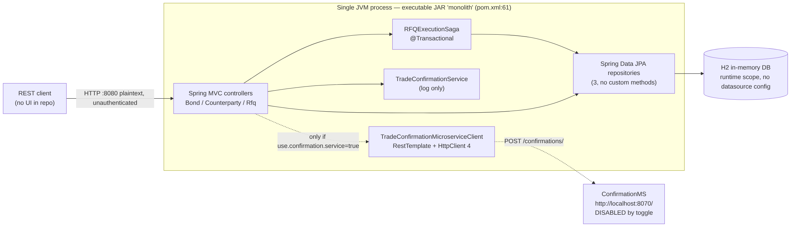
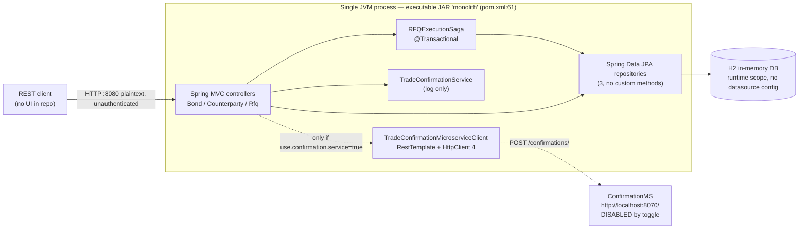
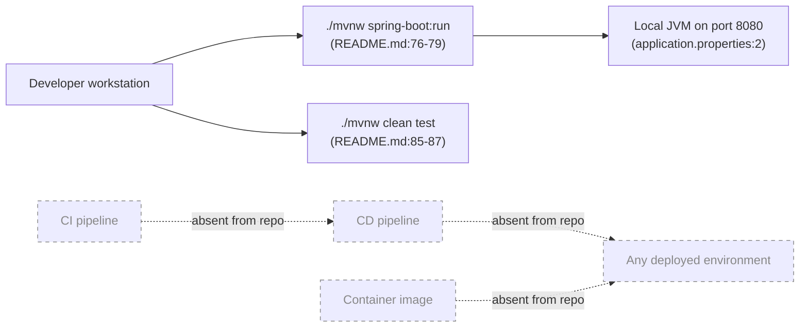

# Current State — Fixed-Income RFQ Trading Platform

Scope: everything in this document is derived from the files committed on `master` of
`COG-GTM/Fixed-Income-RFQ-Trading-Platform` at commit `0b72d81`. Every factual claim carries a
`file:line` citation. Anything not read directly from a file is prefixed **Inference:**.

---

## 1. System context

Mermaid source — context diagram

## 2. Release flow (as committed)

Mermaid source — release flow

**The repository contains no path to any environment other than a developer laptop.** There is no
CI workflow directory, no `Dockerfile`, no Kubernetes/Helm/Compose manifest, no infrastructure-as-code
and no deployment descriptor anywhere in the tracked file list (`git ls-files` returns 32 files, all
of which are source, build wrapper, `README.md`, `LICENSE` and `.gitignore`). The only documented way
to run the application is `./mvnw spring-boot:run` (`README.md:76-79`).

---

## 3. Runtime and framework inventory

| Item | Value | Evidence | Support status |
|---|---|---|---|
| Language level | Java 11 | `monolith/pom.xml:19` | Java 11 is superseded by 17 and 21; **Inference:** most enterprise baselines now require 17+ |
| Framework | Spring Boot `2.2.6.RELEASE` | `monolith/pom.xml:9` | Out of OSS support (2.2.x reached end of open-source support in 2020); no commercial support purchased that the repo can show |
| Build tool | Maven via wrapper 0.5.6, Maven 3.6.3 | `monolith/.mvn/wrapper/maven-wrapper.properties:1-2` | Maven wrapper `io.takari` 0.5.6 is the pre-`maven-wrapper-plugin` generation |
| Packaging | Executable JAR, `finalName=monolith`, `spring-boot-maven-plugin` | `monolith/pom.xml:60-67` | Fat JAR — no container image produced by the build |
| HTTP client stack | Apache HttpComponents `httpclient` 4.x (version managed by the Boot parent) | `monolith/pom.xml:43-46` | HttpClient 4.x is superseded by HttpClient 5 |
| Dev tooling in the runtime classpath | `spring-boot-devtools`, `runtime`/`optional` scope | `monolith/pom.xml:32-37` | DevTools is a development-only component present in the dependency set |
| Server port | 8080, plaintext HTTP | `monolith/src/main/resources/application.properties:2` | No TLS configuration in the repo |
| Test stack | JUnit 5 via `spring-boot-starter-test`, vintage engine excluded | `monolith/pom.xml:47-57` | Single test class, 6 tests (`monolith/src/test/java/com/javieraviles/splitthemonolith/IntegrationTest.java:39-168`) |

Application entrypoint: `SplitTheMonolithApplication` (`monolith/src/main/java/com/javieraviles/splitthemonolith/SplitTheMonolithApplication.java:25-39`).

---

## 4. Datastore

| Question | Answer | Evidence |
|---|---|---|
| Engine | H2, `runtime` scope | `monolith/pom.xml:38-42` |
| Datasource configuration | **None.** `application.properties` contains only 4 lines and no `spring.datasource.*` key | `monolith/src/main/resources/application.properties:1-4` |
| Persistence mode | **Inference:** with H2 on the classpath and no datasource URL, Spring Boot auto-configures an embedded in-memory database and Hibernate defaults `ddl-auto` to `create-drop`; all data is therefore lost on process exit. No file in the repo states otherwise. |
| Schema definition | Hibernate-generated from the three `@Entity` classes; there is no DDL file, and `ddl-auto` appears nowhere in the repo (grep: zero matches) | `entity/Bond.java:15`, `entity/Counterparty.java:16`, `entity/Rfq.java:20` |
| Schema migration tool | **None** — zero matches for `flyway` or `liquibase` across the repository | grep, zero-count |
| ID strategy | `GenerationType.AUTO` on all three entities | `entity/Bond.java:18-20`, `entity/Counterparty.java:19-21`, `entity/Rfq.java:23-25` |
| Numeric precision | `precision = 19, scale = 2` on all money columns; `precision = 7, scale = 4` on `couponRate` | `entity/Counterparty.java:30,34`, `entity/Bond.java:27,33`, `entity/Rfq.java:38,50` |
| Seed data | Written on every application start by a `CommandLineRunner`: one counterparty, one bond, one EXECUTED RFQ | `SplitTheMonolithApplication.java:26,41-52` |
| Open-in-view | Explicitly disabled | `monolith/src/main/resources/application.properties:1` |

### Data-access style — the load-bearing negative

All persistence goes through three empty Spring Data JPA interfaces with **no declared query methods
at all**:

- `repository/BondRepository.java:7`
- `repository/CounterpartyRepository.java:7`
- `repository/RfqRepository.java:7`

Grep zero-counts across `monolith/src`:

| Pattern | Occurrences |
|---|---|
| `@Query` | 0 |
| `nativeQuery` | 0 |
| `JdbcTemplate` | 0 |
| `EntityManager` | 0 |
| Stored-procedure calls (`CallableStatement`, `@Procedure`) | 0 |
| Vendor-specific SQL strings | 0 |

**This is the single most important migration fact in the repository:** there is no hand-written SQL
to port, so an H2 → PostgreSQL engine change is a configuration, schema-generation and ID-strategy
exercise rather than a query-rewriting exercise.

---

## 5. Business logic and transaction boundary

`RFQExecutionSaga.executeRfq` (`saga/RFQExecutionSaga.java:29-47`) is annotated `@Transactional`
(`saga/RFQExecutionSaga.java:29`) and performs, in one database transaction:

1. load the bond, else 404 (`saga/RFQExecutionSaga.java:32-33`);
2. load the counterparty, else 404 (`saga/RFQExecutionSaga.java:34-35`);
3. `bond.deductNotional(...)` which throws `InsufficientNotionalException` when the requested
   notional exceeds inventory (`entity/Bond.java:52-57`);
4. `counterparty.deductCredit(...)` which throws `InsufficientCreditException` when the execution
   price exceeds available credit (`entity/Counterparty.java:58-63`);
5. persist an RFQ with status `EXECUTED` (`saga/RFQExecutionSaga.java:45-46`).

The class is named a saga but the in-code comment states that no compensation is required because
everything runs inside a single transaction (`saga/RFQExecutionSaga.java:38-42`). **Migration
consequence:** atomicity today depends on both aggregates living in one relational database, so any
target that splits counterparty credit and bond inventory into separate datastores turns this into a
distributed-transaction problem.

Both exception types map to HTTP 400 via `@ResponseStatus`
(`exception/InsufficientNotionalException.java:6`, `exception/InsufficientCreditException.java:6`);
`ResourceNotFoundException` maps to 404 (`exception/ResourceNotFoundException.java:6`).

### Concurrency

Neither `Counterparty` nor `Bond` carries a `@Version` field (grep for `@Version`: zero matches
across `monolith/src`). Credit and notional are read-modify-written inside the transaction
(`entity/Counterparty.java:54-63`, `entity/Bond.java:48-57`). **Inference:** with the default
read-committed isolation of a server-based RDBMS and more than one application replica, two
concurrent RFQs against the same bond or counterparty can lose an update and overdraw inventory or
credit. Single-JVM H2 today masks this; horizontal scaling on ECS does not.

---

## 6. Integrations

| Direction | Target | Protocol | Evidence | State |
|---|---|---|---|---|
| Outbound | `ConfirmationMS` at `${confirmationms.url}` + `confirmations/` | HTTP POST, JSON, `RestTemplate` | `restclient/TradeConfirmationMicroserviceClient.java:17-26` | Reachable only when the toggle is on |
| Outbound (configured value) | `http://localhost:8070/` | plaintext HTTP, loopback | `monolith/src/main/resources/application.properties:4` | Hard-coded in the properties file; no service discovery, no DNS name, no TLS |
| Internal fallback | `TradeConfirmationService.sendTradeConfirmation` — writes one log line | none | `service/TradeConfirmationService.java:14-17` | Default path |

The toggle `use.confirmation.service` is `false` (`monolith/src/main/resources/application.properties:3`),
bound in `controller/CounterpartyController.java:33-34`, and branched on in
`controller/CounterpartyController.java:83-87`. The confirmation is emitted **only on a PATCH that
ADDs credit** (`controller/CounterpartyController.java:80-87`) — despite the README's statement that
"a trade confirmation is sent to a counterparty whenever credit is added"
(`README.md:44`), no confirmation is emitted when an RFQ executes and credit is deducted
(`saga/RFQExecutionSaga.java:43`). The README describes the same behaviour the code implements here,
but note the confirmation is not part of trade execution at all.

The `RestTemplate` bean is built on a `CloseableHttpClient` with default settings —
**no connect timeout, no read timeout, no connection-pool sizing** are configured
(`SplitTheMonolithApplication.java:54-64`).

### Integration zero-counts

| Integration type | Occurrences in `monolith/src` |
|---|---|
| Messaging (Kafka, JMS, RabbitMQ, SQS/SNS) | 0 |
| SMTP / email | 0 |
| FTP / SFTP / file shares | 0 |
| Scheduled jobs (`@Scheduled`, Quartz) | 0 |
| Caching (`@Cacheable`, Redis) | 0 |
| File I/O in application code (`Files.`, `FileInputStream`, `FileWriter`) | 0 — the only matches in the repository are inside the Maven wrapper bootstrap `monolith/.mvn/wrapper/MavenWrapperDownloader.java` |
| `WebClient` / reactive stack | 0 |

**Nothing is stateful on local disk, there are no batch windows and there is no broker to migrate.**
That materially shrinks the migration surface.

---

## 7. API surface

Seventeen mappings across three controllers, all unauthenticated:

| Method | Path | Handler |
|---|---|---|
| GET | `/counterparties` | `controller/CounterpartyController.java:45-48` |
| POST | `/counterparties` | `controller/CounterpartyController.java:50-53` |
| GET | `/counterparties/{id}` | `controller/CounterpartyController.java:55-59` |
| PUT | `/counterparties/{id}` | `controller/CounterpartyController.java:61-71` |
| PATCH | `/counterparties/{id}` | `controller/CounterpartyController.java:73-95` |
| DELETE | `/counterparties/{id}` | `controller/CounterpartyController.java:97-100` |
| GET | `/bonds` | `controller/BondController.java:32-35` |
| POST | `/bonds` | `controller/BondController.java:37-40` |
| GET | `/bonds/{id}` | `controller/BondController.java:42-46` |
| PUT | `/bonds/{id}` | `controller/BondController.java:48-59` |
| PATCH | `/bonds/{id}` | `controller/BondController.java:61-77` |
| DELETE | `/bonds/{id}` | `controller/BondController.java:79-82` |
| GET | `/rfqs` | `controller/RfqController.java:31-35` |
| POST | `/rfqs` | `controller/RfqController.java:37-40` |
| GET | `/rfqs/{id}` | `controller/RfqController.java:42-46` |
| DELETE | `/rfqs/{id}` | `controller/RfqController.java:48-51` |

Notes carried into the target design:

- `POST /rfqs` accepts the execution price from the client
  (`dto/RfqDto.java:30-31`, consumed at `saga/RFQExecutionSaga.java:43,46`) — price is not computed
  server-side.
- The PATCH bodies are untyped `Map<String, String>` (`controller/CounterpartyController.java:74`,
  `controller/BondController.java:62`); `new BigDecimal(...)` on a missing key raises
  `NullPointerException`, which is not caught by the `IllegalArgumentException` handler
  (`controller/CounterpartyController.java:92-94`).
- Bean-validation annotations exist on the DTOs and entities (`dto/RfqDto.java:16,19,22,25,30`,
  `entity/Counterparty.java:23,29,33`, `entity/Bond.java:32`, `entity/Rfq.java:27,32,37,41,45,49`)
  but **no controller method parameter is annotated `@Valid`** (grep for `@Valid`: zero matches), so
  request bodies are not validated at the API boundary.

---

## 8. Security, identity and configuration

| Concern | Finding | Evidence |
|---|---|---|
| Authentication / authorisation | **None.** `spring-boot-starter-security` is absent from the POM and there is no `SecurityConfig` (grep: zero matches). Every endpoint above, including `DELETE /counterparties/{id}` and credit-mutating PATCH, is anonymous | `monolith/pom.xml:22-58`, grep zero-count |
| Session model | Stateless — no `HttpSession` use, no session store | grep zero-count |
| Transport | Plaintext HTTP on 8080; no TLS/keystore properties | `monolith/src/main/resources/application.properties:2` |
| Secrets in the repository | **None found.** The only credential-shaped identifiers are the `MVNW_USERNAME` / `MVNW_PASSWORD` environment variables read by the Maven wrapper for authenticated mirrors — variable names only, no values | `monolith/.mvn/wrapper/MavenWrapperDownloader.java:98-104`, `monolith/mvnw:235-244` |
| Configuration source | One properties file, four keys, committed to git; no profiles, no environment overrides, no external config service | `monolith/src/main/resources/application.properties:1-4` |
| CORS | Not configured (grep: zero matches) | grep zero-count |
| Audit trail | RFQ rows carry only `createdAt`, set in `@PrePersist`; no actor, no update timestamps | `entity/Rfq.java:53-54,69-72` |

---

## 9. Observability

| Signal | Finding | Evidence |
|---|---|---|
| Health / readiness endpoint | **None** — `spring-boot-actuator` is not a dependency (grep for `actuator`: zero matches). There is no endpoint an ALB target group or ECS health check can poll today | `monolith/pom.xml:22-58` |
| Metrics | None exported | grep zero-count |
| Tracing | None | grep zero-count |
| Logging | SLF4J, one `logger.info` call in the whole application, on the confirmation fallback path; no structured logging or correlation IDs | `service/TradeConfirmationService.java:12,15-16` |

---

## 10. Contradictions and discrepancies found

1. **README claims Java 11 / Spring Boot / H2 and the POM agrees** (`README.md:6-8` vs
   `monolith/pom.xml:9,19,38-42`) — no contradiction, recorded so the target-state reader does not
   have to re-check.
2. **Artifact identity does not match the product.** The Maven coordinates, application class and
   package are still `com.javieraviles / splitthemonolith` with the description "Monolith handling
   orders, customers and products" (`monolith/pom.xml:12-16`), while the product is a fixed-income
   RFQ platform (`README.md:1-3`). Any registry/repository naming convention applied at migration
   time will collide with this.
3. **The "saga" is not a saga** — one `@Transactional` method with no compensation, by its own
   comment (`saga/RFQExecutionSaga.java:29,38-42`).
4. **The confirmation microservice is configured to `localhost`** (`monolith/src/main/resources/application.properties:4`)
   and disabled (`:3`), so the integration has never had to work against a real remote address in
   any committed configuration.
5. **Validation annotations without `@Valid`** — the constraints in
   `dto/RfqDto.java:16-31` are inert at the boundary.
6. **No health endpoint but a load-balanced target** — every containers-first target design needs a
   health probe path, and none exists (§9).

---

## 11. Fact sheet for the target-state design

| Dimension | Current state | Evidence |
|---|---|---|
| Deployable units | 1 fat JAR | `monolith/pom.xml:60-67` |
| Stateful components | 1 embedded database, ephemeral | `monolith/pom.xml:38-42` + absence of datasource config |
| Local disk state | none | zero-count, §6 |
| Inbound protocols | HTTP/1.1 JSON only | §7 |
| Outbound dependencies | 1, disabled | §6 |
| Background processing | none | zero-count, §6 |
| Auth | none | §8 |
| Health probe | none | §9 |
| CI/CD | none in repo | §2 |
| Container image | none in repo | §2 |
| IaC | none in repo | §2 |
| Hand-written SQL | none | §4 |
