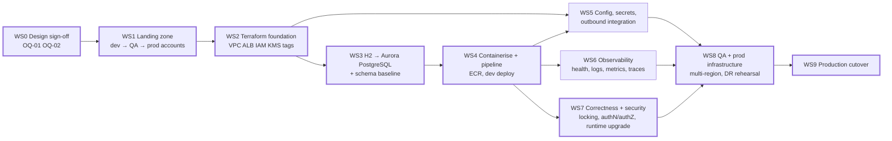

# Migration Plan

Ten workstreams, each independently reviewable and independently deliverable. Effort is in
Devin-session-equivalents (one session ≈ one to two engineer-weeks of conventional effort);
elapsed time is dominated by the external waits called out per workstream, not by the engineering.
Question IDs refer to [open-questions.md](open-questions.md); component IDs (C1…C20) refer to
[target-state.md §4](target-state.md).

Mermaid source — workstream dependency graph

**Critical path:** WS0 → WS1 → WS2 → WS3 → WS4 → WS7 → WS8 → WS9. WS5 and WS6 run in parallel with
WS7 and only need to land before WS8. The longest external waits are the Control Tower account
vending in WS1 (`OQ-04`) and the change-approval window in WS9 (`OQ-17`).

---

## WS0 — Design sign-off and input capture

**Entry criteria:** this package reviewed by Platform Engineering, Security, the DBA and the
Application Owner.

**Work:** replace the assumed service allowlist and the assumed guardrail set with the customer's
own (`OQ-01`, `OQ-02`); confirm the resilience posture (`OQ-03`); confirm this repository is the
deployed artefact and identify any consumer in front of it (`OQ-10`).

**Exit criteria:** allowlist and guardrails confirmed in writing; every `OFF-LIST?` row in
[target-state.md §4](target-state.md) either accepted with its in-list alternative or reopened.

**Effort:** 0.25 session plus review time. **Dependencies:** none.

---

## WS1 — Landing zone and account vending

**Entry criteria:** WS0 complete; OU placement and lead time known (`OQ-04`).

**Work:** raise the Control Tower account-vending request for **dev first**, as G4 requires, then QA,
then prod. Establish the Terraform state backend and provider constraints (`OQ-06`). Capture the
mandatory tag values — owner, cost centre, environment, data classification (`OQ-21`, `OQ-12`).

**Exit criteria:** dev account exists and is reachable by the pipeline identity; QA request is
queued but not required yet.

**Effort:** 0.5 session of engineering; elapsed time is the vending lead time.
**Dependencies:** WS0.

---

## WS2 — Terraform foundation

**Entry criteria:** dev account available; base-image catalogue known (`OQ-05`); exposure model
decided (`OQ-13`).

**Work (C13, C9, C7, C2):** Terraform modules for VPC with private subnets and NAT, VPC endpoints,
internal ALB with an ACM certificate, WAF, ECR repository, KMS keys, IAM task and execution roles,
Secrets Manager and Parameter Store entries, CloudWatch log groups, and the mandatory tag set applied
to everything. No console-built resources (G5).

**Exit criteria:** `terraform apply` produces an empty-but-complete dev environment; a policy scan
shows no public endpoints and no static credentials.

**Effort:** 1.5 sessions. **Dependencies:** WS1.

---

## WS3 — H2 → Aurora PostgreSQL

**Entry criteria:** answers to `OQ-07` (volumes) and, critically, `OQ-08` (does a real production
database exist at all — the committed configuration is an ephemeral in-memory H2 with no datasource
URL, `monolith/src/main/resources/application.properties:1-4`).

**Work (C3, C4, C5):**

1. Provision Aurora PostgreSQL in dev, Multi-AZ, KMS-encrypted, credential in Secrets Manager.
2. Introduce a versioned schema baseline (Flyway or Liquibase) generated from the three entities, and
   set `ddl-auto=validate` in every deployed environment. `GenerationType.AUTO`
   (`entity/Bond.java:18-20`, `entity/Counterparty.java:19-21`, `entity/Rfq.java:23-25`) resolves
   differently on PostgreSQL than on H2, so the baseline must pin the sequence strategy explicitly.
3. Remove the boot-time seeding `CommandLineRunner` (`SplitTheMonolithApplication.java:26,41-52`)
   from the runtime path — against a persistent cluster it re-inserts on every task start and
   violates the unique ISIN constraint (`entity/Bond.java:22`) — and move seeding to a pipeline task.
4. Point the test suite at PostgreSQL (Testcontainers or a dev instance) so the six existing tests
   (`monolith/src/test/java/com/javieraviles/splitthemonolith/IntegrationTest.java:39-168`) exercise
   the target engine.
5. Only if `OQ-08` reveals a real source database: DMS full-load plus CDC, with row-count and
   checksum validation.

**Why this is a workstream and not a table row:** the engine change touches ID generation, schema
ownership, test infrastructure and — if data exists — a freeze window. What makes it *tractable* is
that the application contains **zero hand-written SQL, zero native queries and zero stored
procedures** (current-state §4), so no query rewriting is required.

**Exit criteria:** the full test suite passes against Aurora PostgreSQL; schema is created only by
the migration tool.

**Effort:** 1.5 sessions, plus 1 session if DMS is in scope. **Dependencies:** WS2.

---

## WS4 — Containerisation and delivery pipeline

**Entry criteria:** approved base image identified (`OQ-05`); pipeline tooling and reference pipeline
known (`OQ-16`); internal Maven repository and credential mechanism known (`OQ-18`).

**Work (C1, C2, C12, C16, C18):** multi-stage Dockerfile from an approved base, excluding
`spring-boot-devtools` (`monolith/pom.xml:32-37`) from the runtime image; rename artefact, image and
resource identifiers off `com.javieraviles / splitthemonolith` (`monolith/pom.xml:12-16`); pipeline
stages build → test → image scan → push to ECR → `terraform plan/apply` → ECS service deploy; ECS
Fargate service and task definition in dev.

**Exit criteria:** a commit on the default branch deploys automatically to dev and the seeded
endpoints respond through the internal ALB.

**Effort:** 1.5 sessions. **Dependencies:** WS3 (the task needs a database to start against).

---

## WS5 — Configuration, secrets and the outbound integration

**Entry criteria:** WS4 deploying to dev; `OQ-09` answered (is trade confirmation re-enabled?).

**Work (C7, C10):** move all four properties (`monolith/src/main/resources/application.properties:1-4`)
to Parameter Store and Secrets Manager, injected as task-definition secrets; if confirmation is
re-enabled, replace `http://localhost:8070/` with a resolvable HTTPS endpoint reached through a VPC
endpoint or PrivateLink and add connect/read timeouts and a retry budget to the `RestTemplate`
(`SplitTheMonolithApplication.java:54-64`), which currently has none.

**Exit criteria:** no environment-specific value is baked into the image; if enabled, the
confirmation call succeeds against the real endpoint with timeouts proven by a fault-injection test.

**Effort:** 0.5 session (1 session if the integration is re-enabled). **Dependencies:** WS2, WS4.

---

## WS6 — Observability

**Entry criteria:** WS4 deploying to dev; central observability destination known (`OQ-20`); data
classification known so logs can be redacted correctly (`OQ-12`).

**Work (C6, C11):** add Spring Boot Actuator and wire `/actuator/health` to both the ALB target group
and the ECS container health check — there is no health endpoint today (current-state §9); structured
JSON logging with correlation IDs to replace the single `logger.info`
(`service/TradeConfirmationService.java:15-16`); CloudWatch metrics and alarms on 5xx rate, task
restarts, Aurora CPU and connection saturation; X-Ray tracing.

**Exit criteria:** a deliberately failed task is detected and replaced by the health check; alarms
fire into the central platform.

**Effort:** 0.5 session. **Dependencies:** WS4.

---

## WS7 — Correctness and security blockers

**Entry criteria:** WS4 deploying to dev; `OQ-14` answered (required authN/authZ model).

**Work:**

1. **Concurrency (C17).** Add `@Version` optimistic locking, or pessimistic `SELECT … FOR UPDATE`, to
   `Counterparty` and `Bond`. Credit and notional are read-modify-written
   (`entity/Counterparty.java:54-63`, `entity/Bond.java:48-57`) with no version column anywhere in
   the model; a single H2-backed JVM hides the race, multiple Fargate tasks against one Aurora writer
   do not.
2. **Authentication and authorisation (C8).** The API is entirely anonymous today (current-state §8),
   including `DELETE /counterparties/{id}` (`controller/CounterpartyController.java:97-100`) and the
   credit-mutating `PATCH` (`controller/CounterpartyController.java:73-95`).
3. **Input validation.** Apply `@Valid` at the controller boundary so the existing constraints
   (`dto/RfqDto.java:16-31`) are enforced, and handle the missing-key `NullPointerException` path in
   the PATCH handlers (`controller/CounterpartyController.java:74-94`, `controller/BondController.java:62-76`).
4. **Runtime upgrade (C15).** Java 17/21 on Spring Boot 3.x, including the `javax.*` → `jakarta.*`
   namespace change across entities and DTOs (`entity/Bond.java:6-11`, `dto/RfqDto.java:6-7`) and the
   HttpClient 4 → 5 change implied by `monolith/pom.xml:43-46`. Sequencing note: if no approved base
   image ships Java 11 (`OQ-05`), this item moves ahead of WS4 and onto the critical path.

**These changes are deliberately out of the docs-only PR that carries this package.** They are
tracked here because WS9 is gated on them.

**Exit criteria:** a concurrent-execution test proves no lost update; every endpoint requires an
authenticated principal; the application runs on a supported Spring Boot line.

**Effort:** 3 sessions. **Dependencies:** WS4.

---

## WS8 — QA and production infrastructure, and the DR rehearsal

**Entry criteria:** WS5, WS6 and WS7 complete in dev; QA account vended (G4 requires dev to be
running first); `OQ-03` and `OQ-19` answered (resilience posture, RTO/RPO).

**Work:** promote the Terraform stack into QA and then prod; Aurora Global Database with a secondary
region and a warm-standby ECS service; Route 53 health-check failover; backup retention set to the
agreed RPO; **execute a documented regional failover test and record the measured RTO and RPO**.

**Exit criteria:** QA runs the same image and the same Terraform as dev; prod infrastructure exists
with no traffic on it; the failover test report is signed off. This satisfies guardrail G7.

**Effort:** 2 sessions. **Dependencies:** WS5, WS6, WS7.

---

## WS9 — Production cutover *(final workstream)*

**Entry criteria — all must be true before any production traffic is served:**

| # | Criterion | Source |
|---|---|---|
| 1 | Optimistic or pessimistic locking in place and proven under a concurrent-execution test | WS7.1, C17 |
| 2 | Authentication and authorisation enforced on every endpoint, per the Security answer to `OQ-14` | WS7.2, C8 |
| 3 | Application running on a supported Spring Boot / Java line | WS7.4, C15 |
| 4 | Boot-time seeding removed from the runtime path | WS3.3, C5 |
| 5 | Schema created and versioned only by the migration tool, `ddl-auto=validate` in prod | WS3.2, C4 |
| 6 | Guardrail G7 met: multi-region prod, load balancing in place, **and the DR failover test executed and signed off** with the measured RTO/RPO against `OQ-19` | WS8 |
| 7 | Guardrail G8 met: no public endpoints, TLS at the ALB, KMS encryption at rest, DB credential in Secrets Manager with rotation enabled, no static credentials in any task role | WS2, WS5 |
| 8 | Guardrail G10 met: mandatory tags on every resource, health checks live, alarms firing into the central platform | WS2, WS6 |
| 9 | Data migration validated by row count and checksum, or `OQ-08` confirms there is no source data to migrate | WS3.5 |
| 10 | Consumer cutover agreed: DNS strategy and any dual-run period settled with the Application Owner (`OQ-11`) | WS0, `OQ-11` |
| 11 | Change approval obtained for the agreed release window (`OQ-17`), with a rehearsed rollback | `OQ-17` |

**Work:** freeze writes on the source system if one exists; final DMS CDC catch-up and validation;
switch Route 53 to the AWS ALB; monitor error rate, latency and Aurora saturation through one full
trading day; keep the rollback path warm until the agreed soak period ends.

**Exit criteria:** production traffic served from AWS; rollback path formally retired; the legacy
runtime decommissioned.

**Effort:** 1 session plus the soak period. **Dependencies:** WS8.

---

## Summary

| WS | Name | Effort (sessions) | On critical path |
|---|---|---|---|
| WS0 | Design sign-off | 0.25 | yes |
| WS1 | Landing zone | 0.5 | yes |
| WS2 | Terraform foundation | 1.5 | yes |
| WS3 | H2 → Aurora PostgreSQL | 1.5 – 2.5 | yes |
| WS4 | Containerisation and pipeline | 1.5 | yes |
| WS5 | Config, secrets, integration | 0.5 – 1 | no |
| WS6 | Observability | 0.5 | no |
| WS7 | Correctness and security | 3 | yes |
| WS8 | QA/prod infra and DR rehearsal | 2 | yes |
| WS9 | Production cutover | 1 | yes |

Total engineering: roughly 12–14 sessions. Elapsed time is set by account vending (`OQ-04`), the
answers to the open questions, and the production change window (`OQ-17`) — not by the engineering.
