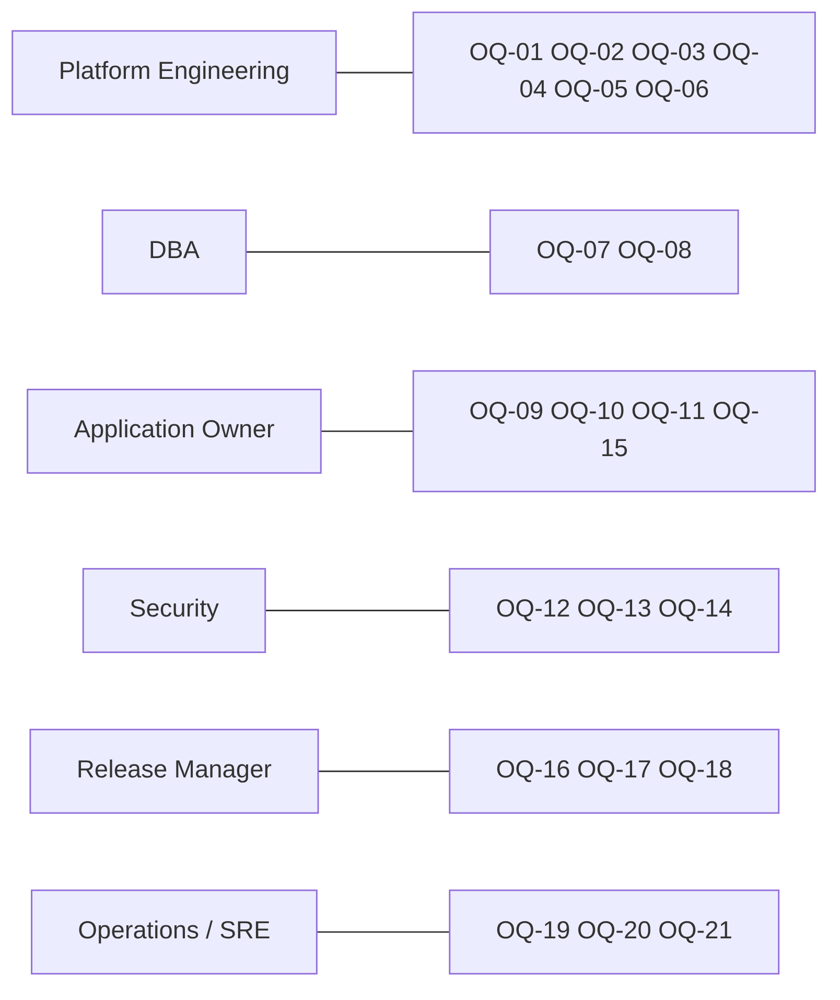
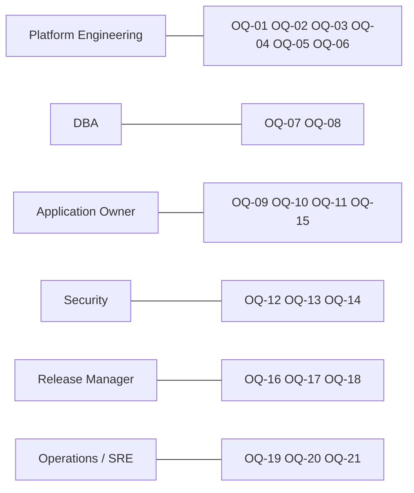

# Open Questions

Every question below is a fact the repository cannot settle. Each has an ID referenced by
[migration-plan.md](migration-plan.md), and each names the role that owns the answer. Questions
`OQ-01` and `OQ-02` gate the whole design: the service allowlist and the guardrail set used in
[target-state.md](target-state.md) are **assumptions made by this package**, not customer policy.

Mermaid source — questions by owning role

---

## Programme and platform

| ID | Question | Owner | Why it matters | Blocks |
|---|---|---|---|---|
| **OQ-01** | The approved ("blessed") AWS service list was not supplied. Is the assumed list in [target-state.md §1](target-state.md) correct, and specifically: are Lambda, EventBridge, Step Functions, EKS, App Runner, RDS Proxy and AppConfig genuinely off-list? | Platform Engineering | Every `OFF-LIST?` row in the target state exists only because of this assumption; approving any of them simplifies the design | WS0, and the sign-off of the whole target state |
| **OQ-02** | No customer platform guardrails were supplied, so the playbook's default set (G1–G10) is in force as an assumption. Are these your guardrails, and what replaces or supplements them? | Platform Engineering | The guardrail-compliance table is only meaningful against the real policy | WS0 |
| **OQ-03** | Is multi-region prod actually required for this workload, or is Multi-AZ with a documented RPO sufficient? The brief states multi-region; nothing in the repo justifies it | Platform Engineering | Aurora Global Database and a second-region ECS service roughly double the prod infrastructure cost and add a failover-test obligation to WS9 | WS8, WS9 |
| **OQ-04** | Which AWS Organizations OU should the dev, QA and prod accounts be vended into, and what is the lead time for the Control Tower request? | Platform Engineering | G4 sequences dev before QA; account lead time is usually the longest external wait in the plan | WS1 |
| **OQ-05** | Which approved container base images are available, and which Java runtime versions do they carry? | Platform Engineering | If no approved base ships Java 11, the Spring Boot 3 / Java 17+ upgrade (C15) moves from "recommended" to "prerequisite" and onto the critical path | WS2, WS4 |
| **OQ-06** | Which Terraform module registry, state backend and provider version constraints are mandated? | Platform Engineering | Determines whether WS2 writes modules or consumes existing ones | WS2 |

## Database

| ID | Question | Owner | Why it matters | Blocks |
|---|---|---|---|---|
| **OQ-07** | What are the real production data volumes and transaction rates? The repository contains only three seeded rows (`SplitTheMonolithApplication.java:41-52`) | DBA | Sets the Aurora instance class, connection-pool sizing and whether RDS Proxy needs to be added to the allowlist | WS3 |
| **OQ-08** | Is there an existing production database for this platform, and if so on which engine — because the committed configuration is an ephemeral in-memory H2 with no datasource URL (`monolith/src/main/resources/application.properties:1-4`)? If one exists, DMS-based data migration and a cutover freeze window are needed; if not, WS3 is a greenfield schema | DBA | This single answer changes WS3 from "create schema" to "migrate data with DMS, validate row counts, plan a freeze" | WS3, WS9 |

## Application

| ID | Question | Owner | Why it matters | Blocks |
|---|---|---|---|---|
| **OQ-09** | Will the trade-confirmation integration be re-enabled on AWS? It is toggled off (`monolith/src/main/resources/application.properties:3`) and points at `http://localhost:8070/` (`:4`) | Application Owner | If it stays off, C10 (endpoint, TLS, timeouts, PrivateLink) drops out of scope; if it is turned on, the target service's real address, protocol and SLA are needed | WS5 |
| **OQ-10** | Is this repository the artefact that is actually deployed today, and is any other component (UI, gateway, scheduler) in front of it? The repo contains no client and no gateway configuration | Application Owner | A hidden consumer would constrain the "REST contract unchanged" commitment in [target-state.md §6](target-state.md) | WS0 |
| **OQ-11** | Who are the API consumers, and can they tolerate a DNS/hostname change at cutover? | Application Owner | Determines whether Route 53 must serve the legacy hostname and whether a dual-run period is needed | WS9 |
| **OQ-15** | `POST /rfqs` accepts the execution price from the client (`dto/RfqDto.java:30-31`, used at `saga/RFQExecutionSaga.java:43,46`). Is client-supplied pricing intentional? | Application Owner | Not a migration item, but a reviewer will raise it; if it is a defect it should be tracked outside this docs-only package | — |

## Security

| ID | Question | Owner | Why it matters | Blocks |
|---|---|---|---|---|
| **OQ-12** | What is the data classification of counterparty names, LEIs, credit limits and executed trade records? | Security | Drives KMS key policy, log-redaction rules, the mandatory data-classification tag (G10) and whether CloudWatch Logs can hold request payloads | WS2, WS6 |
| **OQ-13** | Is an internal-only ALB acceptable, or is external exposure required — and if external, is WAF plus a managed rule set sufficient? | Security | Determines the VPC/edge design and whether public subnets appear at all | WS2 |
| **OQ-14** | The application has no authentication or authorisation of any kind: every endpoint, including `DELETE /counterparties/{id}` (`controller/CounterpartyController.java:97-100`) and credit-mutating `PATCH` (`controller/CounterpartyController.java:73-95`), is anonymous. What authN/authZ must be in place before production? | Security | This is a hard prod-cutover blocker in WS9; network isolation alone is not authorisation | WS7, WS9 |

## Delivery

| ID | Question | Owner | Why it matters | Blocks |
|---|---|---|---|---|
| **OQ-16** | Which pipeline tooling is approved, and does a reference pipeline for "container to ECS Fargate via Terraform" already exist? | Release Manager | Determines whether WS4 is configuration or construction; the repo has no CI or CD at all today | WS4 |
| **OQ-17** | What are the change-approval and release-window rules for a production deployment in this organisation? | Release Manager | Sets the WS9 cutover date and whether a rollback rehearsal is mandatory | WS9 |
| **OQ-18** | Which internal Maven repository must builds resolve through, and what credential mechanism does the pipeline use? The wrapper already supports `MVNW_REPOURL` and `MVNW_USERNAME`/`MVNW_PASSWORD` (`monolith/mvnw:214-215,235-244`) | Release Manager | G9 approved artifact sources; a build that reaches out to Maven Central directly will fail policy | WS4 |

## Operations

| ID | Question | Owner | Why it matters | Blocks |
|---|---|---|---|---|
| **OQ-19** | What are the RTO and RPO for this platform? | Operations / SRE | Decides Aurora backup retention, whether Global Database is warranted (with `OQ-03`) and what the WS9 DR test must demonstrate | WS8, WS9 |
| **OQ-20** | Which central observability platform must receive logs and metrics, and is CloudWatch the destination or only a hop? | Operations / SRE | G10; changes the log-driver and agent configuration in the task definition | WS6 |
| **OQ-21** | Who is the on-call owner and what is the cost centre for the mandatory tag set? | Operations / SRE | G10 tagging cannot be implemented in Terraform without concrete values | WS2 |
