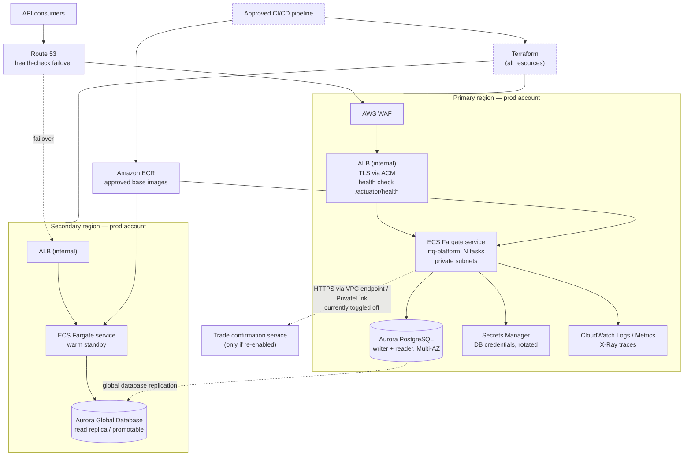

# Target State — AWS

This document proposes the AWS target architecture for the Fixed-Income RFQ Trading Platform. It is
constrained by the service allowlist and the platform guardrails in §1 and §2. **Both are
assumptions made by this package, not customer policy** — confirming or replacing them is
`OQ-01` and `OQ-02` in [open-questions.md](open-questions.md).

---

## 1. ASSUMED approved AWS service list

> **ASSUMPTION — not supplied by the customer.** No blessed service list was provided. The list
> below is the working assumption used to constrain every choice in this document. Anything the
> customer removes from it invalidates the rows that depend on it; anything they add may simplify
> them. Confirming this list is **`OQ-01`**, owned by Platform Engineering.

| Domain | Assumed-approved services |
|---|---|
| Compute | Amazon ECS on AWS Fargate |
| Registry | Amazon ECR |
| Networking / edge | Amazon VPC (private subnets, NAT), Application Load Balancer, Route 53, AWS Certificate Manager, AWS WAF, VPC endpoints / PrivateLink |
| Data | Amazon Aurora PostgreSQL (provisioned, Multi-AZ), Amazon S3, AWS Database Migration Service |
| Security | AWS IAM, AWS KMS, AWS Secrets Manager, AWS Systems Manager Parameter Store, AWS Control Tower, AWS Organizations / SCPs |
| Observability | Amazon CloudWatch (Logs, Metrics, Alarms), AWS X-Ray, AWS CloudTrail, AWS Config |
| Delivery | The organisation's approved CI/CD tooling (assumed external to AWS), Terraform for all infrastructure |
| Resilience | Aurora Global Database, Route 53 health checks and failover routing |

Explicitly **assumed NOT on the list** until confirmed: AWS Lambda, Amazon EventBridge, AWS Step
Functions, Amazon MQ / Amazon MSK, AWS App Runner, Amazon EKS, AWS AppConfig. Where one of these is
the natural fit, the row below is tagged `OFF-LIST?` with an in-list alternative.

## 2. Platform migration guardrails in force

> **ASSUMPTION — these are the playbook's default guardrail set, labelled as assumed defaults.**
> They are not a statement of the customer's own policy. Confirming or replacing them is **`OQ-02`**,
> owned by Platform Engineering.

| # | Guardrail |
|---|---|
| G1 | **Approved-service allowlist.** Only services on the approved list may appear in the target architecture; the allowlist is assumed to be enforced organisation-wide by service control policies. |
| G2 | **Containers first.** The approved managed container platform is the preferred compute target; VM-based lift-and-shift requires explicit written justification. |
| G3 | **Standard target RDBMS.** Relational workloads target PostgreSQL; remaining on a non-standard engine is an exception that must be justified and flagged. |
| G4 | **Account vending and environment promotion.** Workloads onboard through the standard account-vending process (AWS Control Tower) into separate dev, QA and prod accounts; the dev account must be running before QA is granted, and changes promote dev → QA → prod. |
| G5 | **Everything as code.** All target infrastructure is defined in Terraform; no console-built resources. |
| G6 | **Approved delivery toolchain.** CI/CD runs on the organisation's approved pipeline tooling; moving off any legacy delivery mechanism is part of the plan. |
| G7 | **Production entry criteria.** Prod requires the stated resilience posture (multi-region), load balancing, and a demonstrated DR/failover test before approval. |
| G8 | **Security baseline.** Private networking by default, encryption in transit and at rest, least-privilege IAM roles with no long-lived static credentials, secrets only in the approved secrets manager. |
| G9 | **Approved artifact sources.** Container images and dependencies come only from approved registries/repositories. |
| G10 | **Tagging and observability standards.** All resources carry owner, cost centre, environment and data-classification tags and emit logs/metrics to the central observability platform. |

Environment posture used throughout (also an assumption, from the task brief): **multi-AZ in dev,
multi-region in prod**; target RDBMS **Aurora PostgreSQL**; target compute **ECS Fargate**; IaC
**Terraform**; CD on the org's approved pipeline tooling.

---

## 3. Target architecture

Mermaid source — target architecture

---

## 4. Component-by-component mapping

Effort is expressed in Devin-session-equivalents (one session ≈ one to two engineer-weeks of
conventional effort). Risk is H/M/L.

| # | Current component (evidence) | Target AWS service | Rationale | Risk | Effort |
|---|---|---|---|---|---|
| C1 | Fat JAR run by `./mvnw spring-boot:run` (`README.md:76-79`, `monolith/pom.xml:60-67`) | **ECS Fargate service** behind an internal ALB | G2 containers-first; no VM justification exists because the app is stateless with no local-disk state (current-state §6) | M | 1 session |
| C2 | No container image in the repo (`git ls-files`, current-state §2) | **ECR repository** + a multi-stage image built from an approved base (G9) | An image is the unit of promotion under G4; base image must come from the approved registry | M | 0.5 session |
| C3 | H2 in-memory, no datasource config (`monolith/pom.xml:38-42`, `application.properties:1-4`) | **Aurora PostgreSQL**, Multi-AZ in dev/QA, **Aurora Global Database** in prod | G3 standard engine. Zero hand-written SQL (current-state §4) makes this a configuration and schema-generation change, not a query rewrite | M | 1.5 sessions |
| C4 | Hibernate-generated schema, `GenerationType.AUTO`, no migration tool (`entity/Bond.java:18-20`, grep zero-count for flyway/liquibase) | **Flyway or Liquibase baseline scripts**, applied by the pipeline; `ddl-auto=validate` in every deployed environment | `AUTO` resolves to identity on H2 and to sequences on PostgreSQL, so the generated DDL differs between the two engines; a versioned baseline removes the ambiguity and satisfies G5 | H | 1 session |
| C5 | Seed data written on every boot (`SplitTheMonolithApplication.java:26,41-52`) | **Removed from the runtime path**; dev/QA seeding becomes a pipeline task | Against a persistent Aurora cluster this inserts duplicate rows on every task start and will violate the unique ISIN constraint (`entity/Bond.java:22`) | H | 0.25 session |
| C6 | No health endpoint (`monolith/pom.xml:22-58`, grep zero-count for actuator) | **Spring Boot Actuator** `/actuator/health` wired to the ALB target group and the ECS container health check | Without it, no target group can determine task health; blocks G7 load balancing | M | 0.25 session |
| C7 | Config in a committed properties file (`application.properties:1-4`) | **SSM Parameter Store** for non-secret config, **Secrets Manager** for the DB credential, injected as ECS task-definition secrets | G8: no secrets in code or config; per-environment values without rebuilding the image | L | 0.5 session |
| C8 | No authentication on any endpoint (current-state §8) | **ALB internal-only + WAF**, plus an application-level authN/authZ decision (`OQ-14`) | Private networking (G8) reduces exposure but is not authorisation; a trading API that mutates credit cannot ship to prod anonymous | H | 1 session (design + implement) |
| C9 | Plaintext HTTP on 8080 (`application.properties:2`) | **TLS terminated at the ALB with ACM**, HTTP only inside the VPC security group | G8 encryption in transit | L | 0.25 session |
| C10 | `RestTemplate` on HttpClient 4 with no timeouts to `http://localhost:8070/` (`SplitTheMonolithApplication.java:54-64`, `application.properties:4`) | **HTTPS to a resolvable endpoint via VPC endpoint / PrivateLink**, timeouts and retry budget configured; endpoint value from Parameter Store | A loopback URL cannot survive containerisation; missing timeouts turn a slow dependency into thread-pool exhaustion. Currently disabled (`application.properties:3`), so this is only on the critical path if the customer re-enables it (`OQ-09`) | M | 0.5 session |
| C11 | One `logger.info`, no metrics, no tracing (`service/TradeConfirmationService.java:12-16`) | **CloudWatch Logs** via the `awslogs` driver, **CloudWatch metrics**, **X-Ray** traces, structured JSON logging | G10 central observability | M | 0.5 session |
| C12 | No CI, no CD (current-state §2) | **Approved CI/CD pipeline**: build → test → image scan → push to ECR → Terraform plan/apply → ECS deploy, promoting dev → QA → prod | G4 and G6 | M | 1 session |
| C13 | No IaC (current-state §2) | **Terraform** modules for VPC, ALB, ECS, Aurora, IAM, Secrets, CloudWatch, WAF, Route 53 | G5 | M | 1.5 sessions |
| C14 | No accounts or landing zone | **Control Tower–vended dev, QA and prod accounts**, dev first | G4 explicitly sequences dev before QA | L | 0.5 session (mostly customer process time) |
| C15 | Java 11 / Spring Boot 2.2.6 (`monolith/pom.xml:9,19`) | **Java 17 or 21 on Spring Boot 3.x**, on an approved base image | Boot 2.2.x is out of open-source support; approved base images are unlikely to ship a Java 11 runtime (G9). Carries the `javax.*` → `jakarta.*` namespace change across all entities and DTOs (`entity/Bond.java:6-11`, `dto/RfqDto.java:6-7`) | H | 2 sessions |
| C16 | `spring-boot-devtools` in the dependency set (`monolith/pom.xml:32-37`) | **Excluded from the production image** | DevTools should not be present in a deployed artifact | L | 0.1 session |
| C17 | No `@Version`, read-modify-write on credit and notional (`entity/Counterparty.java:54-63`, `entity/Bond.java:48-57`) | **Optimistic locking (`@Version`) or `SELECT … FOR UPDATE`** before running more than one task | Single-JVM H2 hides the race; N Fargate tasks against one Aurora writer do not. This is a correctness blocker on the cutover gate | H | 0.5 session |
| C18 | Artifact coordinates still `com.javieraviles / splitthemonolith` (`monolith/pom.xml:12-16`) | **Renamed image, repository and resource names** to the platform's naming standard | Required for G10 tagging/ownership and for anyone to find the workload | L | 0.25 session |
| C19 | Client-supplied execution price (`dto/RfqDto.java:30-31`, `saga/RFQExecutionSaga.java:43`) | **Unchanged by the migration**; recorded as a product decision, not an infrastructure one | Out of scope for lift-to-AWS, but a reviewer will ask (`OQ-15`) | — | — |
| C20 | Saga atomicity in one DB transaction (`saga/RFQExecutionSaga.java:29,38-42`) | **One Aurora cluster, one transaction — unchanged** | Preserving a single relational transaction avoids inventing a distributed transaction; any future service split reopens this | L | 0 |

### Off-list temptations, and the in-list alternative used instead

| Natural choice | Status | In-list alternative adopted | Why |
|---|---|---|---|
| Amazon EventBridge for asynchronous trade confirmations | `OFF-LIST?` | Synchronous HTTPS call from the ECS task through a VPC endpoint (C10) | Keeps the existing call shape; no new integration pattern to approve |
| AWS Step Functions to orchestrate the "saga" | `OFF-LIST?` | Keep the single `@Transactional` method inside the service (C20) | There is no compensation logic to orchestrate (`saga/RFQExecutionSaga.java:38-42`) |
| AWS Lambda for the seed/bootstrap job | `OFF-LIST?` | A one-shot ECS task run by the pipeline (C5) | Reuses the same image and the same execution role |
| Amazon EKS | `OFF-LIST?` (assumed) | ECS Fargate (C1) | One service, no platform team to run a cluster; ECS Fargate satisfies G2 |
| AWS AppConfig for the `use.confirmation.service` toggle | `OFF-LIST?` | SSM Parameter Store value read at task start (C7) | The toggle changes rarely; a task-definition redeploy is acceptable |
| Amazon RDS Proxy | `OFF-LIST?` | Application-side HikariCP pool sizing (C1) | Only needed if task counts grow; revisit with `OQ-07` |

---

## 5. Guardrail compliance

| Guardrail | How the target design satisfies it | Exception raised |
|---|---|---|
| G1 approved-service allowlist | Every service in §3 comes from the §1 list; six natural choices were rejected and tagged `OFF-LIST?` with in-list alternatives (§4) | The list itself is assumed — `OQ-01` |
| G2 containers first | ECS Fargate (C1) with an ECR image (C2); no EC2 instance appears anywhere in the design, so no lift-and-shift justification is needed | None |
| G3 standard target RDBMS | Aurora PostgreSQL (C3); H2 is not retained in any environment, including tests, after WS3 | None |
| G4 account vending and promotion | Control Tower–vended dev, QA and prod accounts (C14); pipeline promotes dev → QA → prod (C12); WS1 delivers the dev account before QA is requested | None |
| G5 everything as code | Terraform modules for every resource in §3 (C13); the only manual step is the account-vending request itself | None |
| G6 approved delivery toolchain | The pipeline in C12 replaces the current "developer laptop" release path (current-state §2) — there is no legacy pipeline to retire, only an absence to fill | None |
| G7 production entry criteria | Multi-region prod with Aurora Global Database and Route 53 failover (§3); ALB load balancing (C1, C9); DR failover test is an explicit entry criterion of WS9 in the migration plan | Multi-region prod is an assumption from the brief — `OQ-03` |
| G8 security baseline | Private subnets and internal ALB (C8); TLS at the ALB with ACM (C9); Aurora encrypted with KMS; DB credential in Secrets Manager with rotation (C7); ECS task and execution roles scoped per environment, no static keys. The repository contains no committed secrets today (current-state §8) | The application has no authN/authZ at all (C8) — a prod blocker, `OQ-14` |
| G9 approved artifact sources | Image built `FROM` an approved base and pushed to ECR (C2); Maven resolves through the approved internal repository, which the wrapper already supports via `MVNW_REPOURL` (`monolith/mvnw:214-215`) | Approved base image must ship Java 17/21, forcing C15 — `OQ-05` |
| G10 tagging and observability | Terraform applies the mandatory tag set to every resource; Actuator health (C6), CloudWatch logs/metrics and X-Ray (C11) | Data classification for counterparty credit and LEI data is undetermined — `OQ-12` |

---

## 6. What the target explicitly does not change

- The domain model and the three tables it maps to (`entity/Bond.java:15`, `entity/Counterparty.java:16`, `entity/Rfq.java:20`).
- The public REST contract (current-state §7) — paths, verbs and payloads are preserved so that
  consumers are unaffected by the platform move.
- The single-transaction execution semantics (`saga/RFQExecutionSaga.java:29`).
- Any decomposition into microservices. The confirmation client (`restclient/TradeConfirmationMicroserviceClient.java:23-26`)
  shows an earlier decomposition intent, but splitting services during a platform migration would
  change two variables at once.
